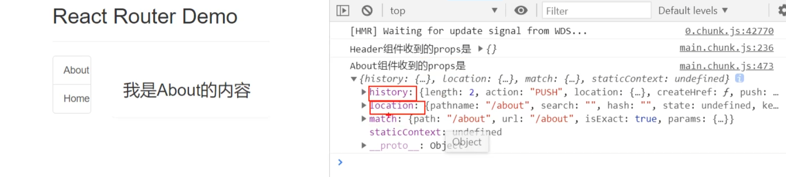
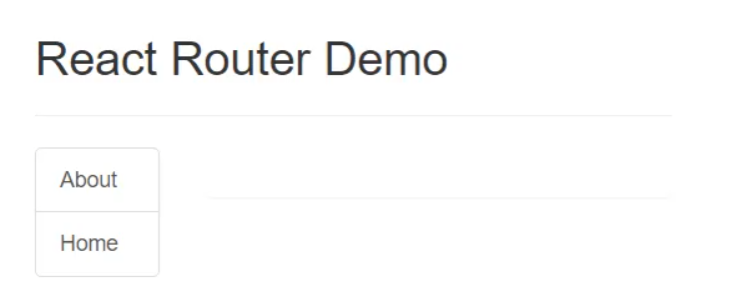
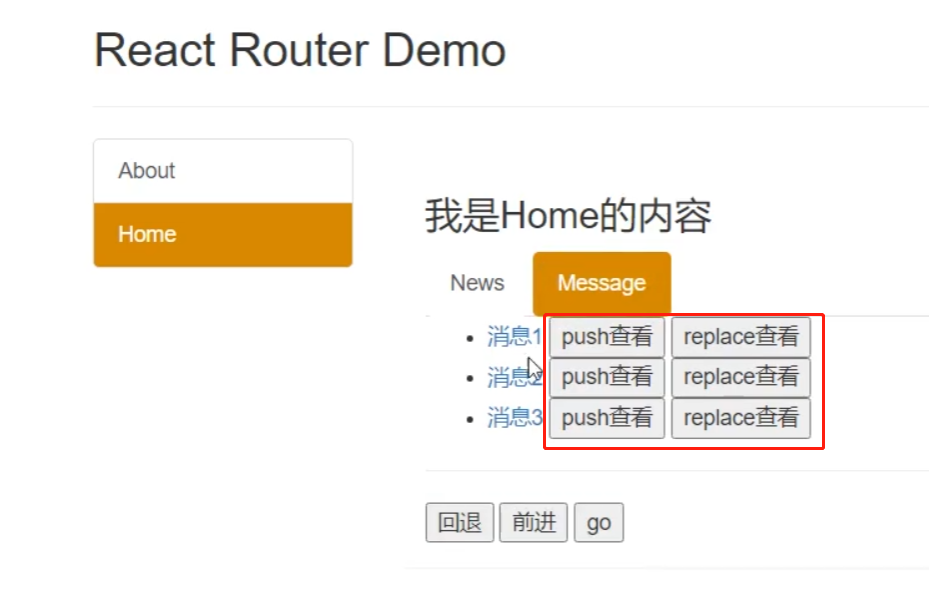
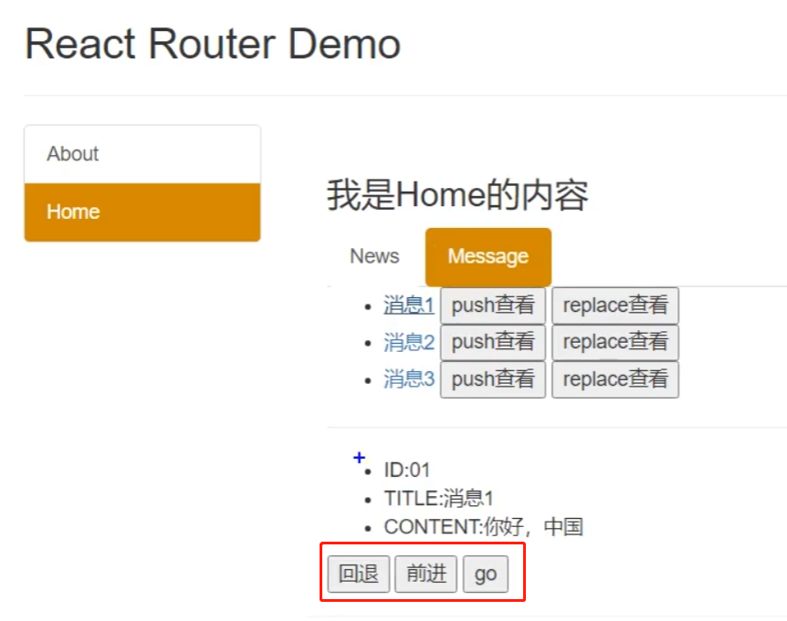
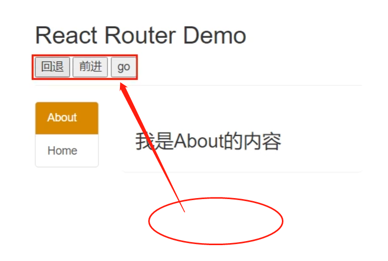

# [二] React 脚手架

# 1 初始化脚手架

## 1.1 启动项目

### 1.1.1 创建项目并启动

1. 全局安装：`npm i -g create-react-app`
2. 切换到想创建项目的目录,使用命令：`create-react-arr hello-react`
3. 进入项目文件夹
4. 启动项目：`npm start`

### 1.1.2 react 脚手架项目结构

public ---- 静态资源文件夹

​			favicon.icon ------ 网站页签图标

​            **index.html --------** **主页面**，项目只有一个 `.html` 文件，SPA（single page app）单页面应用。

​            logo192.png ------- logo图

​            logo512.png ------- logo图

​            manifest.json ----- 应用加壳的配置文件

​            robots.txt -------- 爬虫协议文件

src ---- 源码文件夹

​            App.css -------- App 组件的样式

​            **App.js --------- App 组件**，项目只有一个父组件，放到 `<div id="root"></div>` 中，其余自己添加的组件，都放到 App 组件中。 、

​            App.test.js ---- 用于给 App 做测试

​            index.css ------ 项目的通用样式

​            **index.js -------** **入口文件**

​            logo.svg ------- logo 图

​            reportWebVitals.js 	------- 页面性能分析文件 (需要 web-vitals 库的支持)

​            setupTests.js 			  ------- 组件单元测试的文件 (需要 jest-dom 库的支持)

### 1.1.3 index.html

默认的 index.html 如下：

```html
<!DOCTYPE html>
<html lang="en">
  <head>
      <meta charset="utf-8" />
      <!-- %PUBLIC_URL%代表public文件夹的路径 -->
      <link rel="icon" href="%PUBLIC_URL%/favicon.ico" />
      <!-- 开启理想视口，用于做移动端网页的适配 -->
      <meta name="viewport" content="width=device-width, initial-scale=1" />
      <!-- 用于配置浏览器页签+地址栏的颜色(仅支持android浏览器) -->
      <meta name="theme-color" content="red" />
      <meta
            name="description"
            content="Web site created using create-react-app"
      />
      <!-- 用于指定网页添加到手机主屏幕后的图标(仅支持ios浏览器)  -->
      <link rel="apple-touch-icon" href="%PUBLIC_URL%/logo192.png" />
      <!-- 应用加壳时的配置文件，可以给html加壳为android或ios应用 -->
      <link rel="manifest" href="%PUBLIC_URL%/manifest.json" />
      <title>React App</title>
  </head>
  <body>
	<!-- 若llq不支持js则展示标签中的内容 -->
    <noscript>You need to enable JavaScript to run this app.</noscript>
    <div id="root"></div>
  </body>
</html>
```

最终缩减的 index.html 如下：

```html
<!DOCTYPE html>
<html>
	<head>
		<meta charset="UTF-8" />
		<title>react脚手架</title>
		<link rel="icon" href="%PUBLIC_URL%/favicon.ico" />
		<link rel="stylesheet" href="/css/bootstrap.css">
		<style>
			.atguigu{
				background-color: rgb(209, 137, 4) !important;
				color: white !important;
			}
		</style>
	</head>
	<body>
		<div id="root"></div>
	</body>
</html>
```

- 在地址中 `href="%PUBLIC_URL%/favicon.ico"`  ，使用 `%PUBLIC_URL%` 的前后百分号锁定文件夹是 `public`。在路由中，相比使用  `./favicon.ico`的形式，百分号不会产生地址错误。


### 1.1.4 index.js

入口文件，引入 react 核心库、react-dom 核心库、App 组件等必要的资源：

```js
import React from 'react';
import ReactDOM from 'react-dom';
import './index.css';
import App from './App';
import reportWebVitals from './reportWebVitals';

ReactDOM.render(
  <React.StrictMode> 
    <App />
  </React.StrictMode>,
  document.getElementById('root')
);

reportWebVitals();
```

- `<React.StrictMode> `：可以检测 React 内的组件是否编写合理；
- `reportWebVitals`：页面性能测试，暂时不用；


### 1.1.5  启动流程

1. 在 `src` 下 `index.js`:
   - 引入 react 核心库；
   - 引入 react-dom 核心库；
   - 引入 index CSS 样式；
   - 引入 App 组件；
   - 触发 `ReactDOM.render()` 渲染 App 组件；
     - 引入 App 组件时，就会把相应的 CSS、JS 代码全部引入。

2. 在 `index.js` 文件执行后，React 通过 webpack 的配置文件，找到 `src` 下的 `index.html`：
   - 依次执行 `index.html` 中的程序，
3. 最终，渲染出 `index.html` 的页面。


## 1.2 快捷键

`rcc`	----------	快速创建一个对象组件模板；

`fpc`     ----------	快速创建一个纯对象组件模板（pureComponent）；

`rfc`	----------	快速创建一个函数组件模板；

`imp`	----------	快速引入一个 `import`；

`ctrl + shift + /` ---- Jsx 的快速注释


# 2 小案例知识点

## 2.1 todoList 案例相关知识点

1. 拆分组件、实现静态组件，注意：className、style的写法：
   - 在 HTML 中 ：`style="display: none"`
   - 在 JSX 中 ：`style={{display: 'none'}}`


2. 动态初始化列表，如何确定将数据放在哪个组件的 state 中？
   - 如果是某个自己组件使用：放在其自身的 state 中；
   - 如果是多个组件都要使用：放在他们共同的父组件 state 中（官方称此操作为：状态提升）。


3. 关于父子之间通信：

​        1.【父组件】给【子组件】传递数据：通过 `props` 传递

​        2.【子组件】给【父组件】传递数据：通过 `props` 传递，要求父子组件给子传递一个回调函数，子组件通过调用这个函数，把数据传递给父组件。

```js
// 父组件
// 父组件中的回调
addTodo = (todoObj) =>{
    // 获取自身 state 中原来的 todos
    const {todos} = this.state
    // 创建一个新 todo，添加获取的新 todo
    const newTodos = [todoObj,...todos]
    // 更新自身 state 中的 todos
    this.setState({todos:newTodos})
}
//.....省略组件其他逻辑
//.....省略组件其他逻辑

// 在render中通过props传递给子组件 Header
< Header addTodo=｛this.addTodo｝/>
    
// 子组件
// 在子组件的事件触发函数中使用该方法：
handleKeyUp = (event) => {
    //... 触发事件中的其他逻辑
    // 通过调用父组件发过来的 addTodo 函数，把自己的数据传递给父组件。
    this.props.addTodo(target.value)
}
```


4. 注意 `defaultChecked` 和 `checked` 的区别：

这两个属性是 `input` 标签中的，用来标识选项是否打钩。

- `checked` 控制了选项是否打钩，是一个布尔值。可以通过 `onChange` 回调，用户点击后进行打钩切换；
- `defaultChecked` 属性设定了在初次显示 `input` 标签的时候，标签是否打钩。

```js
// checked 属性
<input type="checkbox" checked={true} />
    
// defaultChecked 属性
<input type="checkbox" defaultChecked={true} />
```


5. 注意 `defaultValue` 和 `value` 的区别：

- `defaultValue` 默认值，才标签第一次显示内容的时候展示，之后再修改该值不会再起作用。
- `value`：标签的数值，随着值的修改，内容会相应修改。


6. `state` 状态在哪里，操作状态的方法（`handle` 回调）就在哪里。


7. 消息订阅与发布 ----- 兄弟节点之间的通信方式

使用 `PubSub` 库。把 state 状态保存在订阅方，如果其他兄弟组件想对这个组件的 state 修改，就发布消息，这个组件就订阅消息：

- 发布消息（发送信息））：`PubSub.publish(消息名称,传的数据)`

- 订阅消息（接收信息）：`PubSub.subscribe(消息名称，收到消息的回调函数)`


## 2.2 github搜索案例相关知识点

1. 设计状态时要考虑全面，例如带有网络请求的组件，要考虑请求失败怎么办。

2. ES6小知识点：解构赋值+重命名

   ```js
   let obj = {a:{b:1}}
   const {a} = obj; //传统解构赋值
   const {a:{b}} = obj; //连续解构赋值
   const {a:{b:value}} = obj; //连续解构赋值+重命名
   ```

3. 消息订阅与发布机制

   1. 先订阅，再发布（理解：有一种隔空对话的感觉）
   2. 适用于任意组件间通信
   3. 要在组件的componentWillUnmount中取消订阅

4. fetch 发送请求（关注分离的设计思想）

   ```js
   try {
      const response= await fetch(`/api1/search/users2?q=${keyWord}`)
      const data = await response.json()
      console.log(data);
   } catch (error) {
       console.log('请求出错',error);
   }
   ```

fetch 获取数据从一步拆成了两步：先尝试联系服务器，连接成功后开始获取数据。


# 3 React 路由

## 3.1 相关理解

### 3.1.1 SPA

1. 单页Web应用（single page web application，SPA）。
2. 整个应用只有 **一个完整的页面**。
3. 点击页面中的链接 **不会刷新** 页面，只会做页面的 **局部更新。**
4. 数据都需要通过 ajax 请求获取, 并在前端异步展现。


### 3.1.2 路由

#### ① 什么是路由?

1. 一个路由就是一个映射关系 (key / value)：
   - key 是一个路径，如`"/serch/users"`；
   - value 可能是 function（后端） 或 component（前端）。

#### ② 路由分类

##### 1、后端路由

1)   理解： value 是 function，用来处理客户端提交的请求。

2)   注册路由： `router.get(path, function(req, res))`

3)   工作过程：当 node 接收到一个请求时, 根据请求路径找到匹配的路由, 调用路由中的函数来处理请求, 返回响应数据

##### 2、前端路由

1. 浏览器端路由，value 是 component，用于展示页面内容。
2. 注册路由：`<Route path="/test" component={Test}>`

3. 工作过程：当浏览器的 pat h变为 `.../test` 时, 当前路由组件就会变为 Test 组件


### 3.1.3 小知识

#### 1. `onclick="function()"` 和 `onclick="return function();"` 区别

- `οnclick="function()"`：只执行 `function`，但是不会传回 `function` 中的返回值；

- `onclick="return function()"` ：则是先执行 `function` 并传回 `function` 中的返回值；

比如，浏览器对 a 标签的默认行为是，当用户点击标签后，就会发生跳转行为。这是因为 `onclick` 事件默认会得到一个 `true` 的返回值。

当我们使用 `retun` （`onclick` 中有一个，`handle` 函数中还有一个）来给 a 标签添加一个  false 的返回值，就会阻止浏览器的跳转行为，并在 `handle` 函数中执行自己的业务逻辑：

```html
<a href="http://abc.xyc.com" onclick="return handle()">点击跳转</a>

<script>
function handle() {
	//用户点击链接，阻止用户跳转其他网页，而是利用路由实现单页面展示。
    return false
}
</script>
```


#### 2 链接如何跳转： 

**链接的跳转是依靠 BOM 中 window.history 实现的。**

通过 `history.js` 库，简单介绍一下基本的实现原理：

1. 提前准备工作：`let history = History.createBrowserHistory()`。通过 `history.js` 库，我们创建一个比直接调用 BOM 更方便的方式，来修改 BOM 中的 `window.history` 属性。
2. 当用户点击 `a` 标签，触发了 `onClick` 中的函数；
3. 在函数中，
   1. 使用 `history.push()` 会往历史记录中添加一个地址。
   2. 我们 `return  false` 阻止浏览器的自动跳转行为；
4. 在函数 `history.listen(location = > { console.log("请求路由路径变化了", location)})` 的监听中，我们就可以通过 `location` 参数获得变化的路径，然后根据不同的路径再展示不同的组件到页面。


**前端路由的跳转，也是依靠 BOM： `window.history` 的属性操作来实现的。**


#### 3. BrowserHistory 和 HashHistory 的区别

BrowserHistory 是 H5 推出的 history 身上的 API；

HashHistory 是利用 hash值（锚点跳转），兼容性更强。

```jsx
// BrowserHistory的地址:
127.0.0.1:5500/index.html/test1

// HashHistory的地址，多了一个'#'，锚点的标记
127.0.0.1:5500/index.html#/test1
```


#### 4. 什么是 route

路由器 router：管理路由的

路由 route：路由（routing）是指分组从源到目的地时，决定端到端路径的网络范围的进程。是在 OSI 中是网络层的数据包的转发设备。

- 路由是指路由器上一个接口中收到的数据包。根据数据包的目的地址，进行定向并转发到另一个接口的过程。
- 所以，前端的路由，就是指在 URL 中监听到地址的变化，然后根据地址变化进行对应页面显示的过程。


## 3.2 路由基本使用

react-router-dom

- 一个 React 的插件库，专门实现 web 前端的路由实现。


#### 1 明确好界面中的导航区、展示区

- 导航区，点击后会发生页面变化的链接；
- 展示区，页面变化的主体。每个展示区，都是一个组件。


#### 导航区+展示区的使用：

传统的 HTML 中 `a` 标签：

```html
<!-- 作为对比：原生html中，靠<a>跳转不同的页面 -->
<a className="list-group-item" href="./about.html">About</a>
<a className="list-group-item active" href="./home.html">Home</a>
```

在 React 中，使用路由依靠 **路由链接** 实现切换组件。

首先需要在使用路由的外侧，包裹一个 Router 类的标签，有两种可选择：`BrowserRoute` 或 `HashRoute`。

- `Router` 组件有两种，`BrowserRoute` 或者 `HashRouter`。

在整个项目的路由跳转中，要在同一个 `BrowserRouter`  标签的管理下。通常是整个项目都是同一个 `BrowserRouter`  的管理。


**第一步**，把 `<BrowserRouter>` 在 `index.js` 中包裹：

```js
// --------------------- index.js ----------------------
//引入react核心库、ReactDOM
import React from 'react'
import ReactDOM from 'react-dom'

//在 index.js 中，使用 BrowserRouter：
import {BrowserRouter} from 'react-router-dom'
//引入App 组件
import App from './App'

ReactDOM.render(
	 <BrowserRouter>
		<App/>
	</BrowserRouter>,
	document.getElementById('root')
)
```

然后，可以正式的使用路由：

```jsx
// --------------------- App.jsx 的 render() return 中部分内容 ----------------------
{/* 0 */}
{/* 需要在开头先引入 Link 和 Route 组件： */}
import { Link, Route } from "react-router-dom";

{/* 1 */}
{/* 编写路由链接 */}
<BrowserRouter>
	<Link className="list-group-item" to="/about">About</Link>
	<Link className="list-group-item" to="/home">Home</Link>
</BrowserRouter>

{/* 2 */}
{/* 注册路由 */}
<Route path="/about" component={About} />
<Route path="/home" component={Home} />
```

**第二步**，编写路由链接（导航区）：

- 需要在开头先引入 `Link` 组件

- 用`Link` 标签替换之前的 `a` 标签。
  - `to` 属性：相当于 `a` 标签的 `href`，也就是跳转地址。
  - `push` 属性（可选）：
    - 如果不填 `push` 和 `replace` 就默认是 `push` 模式。
    - 布尔值，默认 `true`；
    - 开启后，浏览器的 history 的栈结构可以正常的记录页面访问记录，可以前进后退。
  - `replace` 属性（可选）：
    - 布尔值，默认 `false`，如果设置为 `true`：
    -  浏览器的 history 中会这样记录：当点击这个 `link` 连接后，会把替换当前的页面历史记录，而不是把历史记录添加到当前页面的后面。


**第三步**，注册路由（展示区）：

- 在开头先引入 `Route` 组件。
- `path` 属性：填入跳转地址，若发生跳转的地址与其匹配，就会展示该 `Route` 组件 `component` 属性的值。
- `component` 属性：发生跳转后，会展示的组件。注意属性名称 **开头小写**。


### 3.3 路由组件和一般组件的区别是什么?

#### 1 写法不同

一般组件：`<Home/>`，

路由组件：`<Route path="/home" component={Home}>`。


#### 2 文件在项目中存放位置不同

一般组件：在项目中放在 components 文件夹中。

路由组件：在项目中放在 pages 文件夹中。


#### 3 收到的 props 不同

**一般组件**：只能传递 `props` 给子组件。父组件中，写子组件标签时传递了什么，就能收到什么。在子组件的 `this.props` 中，有父组件传递过来的 `props`。

**路由组件**：传递 props 和 **很多路由相关信息** 给子组件，子组件的 `this.props` 有：

- `history`
- `location`
- `match  `
- 还有很多，不常用

```jsx
// this.props中的三大属性：
history:
    go: ƒ go(n)
    goBack: ƒ goBack()
    goForward: ƒ goForward()
    push: ƒ push(path, state)
    replace: ƒ replace(path, state)

location:
    pathname: "/about"
    search: ""
    state: undefined

match:
	params: {}
    path: "/about"
    url: "/about"
```

history 中的 5 个方法，在 3.11 编程式路由导航中有详细介绍。

- `go(step)` ：指定参数的数字前进 / 后退。如果是 2，前进 2 步；如果是 -2 后退，2 步。
- `goBack()`：后退 1 步；
- `goForward()`：前进 1 步；
- `push(path, state)`：采用 push 方法记录历史，默认采用 push 方法。
- `replace(path, state)`：采用 replace 方法记录历史，会把点击后的网页历史，顶替掉上一个网页的历史


```jsx
{/*一般组件 */}
<Home name={Moxy} />

{/*路由组件 */}
<Route path="/about" component={About} />
```




### 3.4 NavLink 和 Link 组件有什么不同？

Link 替换了 HTML 中的 `a` 标签，是 Route 中实现跳转功能的导航区。

NavLink 组件比 Link 组件多了添加样式功能，可以在用户点击某个 NavLink 后，为这个标签添加类名：

```js
<NavLink activeClassName="blue" className="list-group-item" to="/about">About</Link>
<NavLink activeClassName="blue" className="list-group-item" to="/home">Home</Link>
<NavLink activeClassName="blue" className="list-group-item" to="/head">Header</Link>
<NavLink activeClassName="blue" className="list-group-item" to="/foot">Footer</Link>
```

- 当该链接被激活时，就会把 `activeClassName` 的属性值添加为类名。如果不设置 `activeClassName` 属性，就会默认添加类名  `active` 。


#### NavLink 的封装

可以看到，当有过多的 NavLink 设置是，会有非常多相同的相同的内容。这是可以通过对 NavLink 进行封装解决。

定义一个自定义组件： `MyNavLink`

```jsx
// ----------------- components/MyNavLink/index.jsx ---------------

import React, { Component } from 'react'
import {NavLink} from 'react-router-dom'

export default class MyNavLink extends Component {
	render() {
		// console.log(this.props); 接收到props，然后写入每个NavLink不同的部分。
		return (
			<NavLink 
                activeClassName="atguigu" 
                className="list-group-item" 	
                {...this.props}    // 通过扩展运算符，浅拷贝对象（相当于展开），props中的属性
            />
		)
	}
}
```

然后在 `App.js` 中使用：

```js
// MyNavLink 是自己定义的一般组件，通过props传递消息。
<MyNavLink to="/home">About</MyNavLink>
<MyNavLink to="/home">Home</MyNavLink>
<MyNavLink to="/head">Header</MyNavLink>
<MyNavLink to="/foot">Footer</MyNavLink>
```

- `<NavLink>标签体内容</NavLink>`

标签体内容，也是一个特殊的标签属性，通过：`children` 属性传递。

下面两个表达方式是一样的。

```jsx
<MyNavLink to="/foot">Footer</MyNavLink>
<MyNavLink to="/foot" children="Footer" />
```


### 3.5 Switch 组件解决了什么问题？

先有情况如下：

```jsx
<Route path="/about" component={About}
<Route path="/home" component={Home}/>
<Route path="/a" component={a}/>
<Route path="/b" component={b}/>
<Route path="/c" component={c}/>
<Route path="/d" component={d}/>
<Route path="/e" component={e}/>
<Route path="/f" component={f}/>
<Route path="/home" component={Test}/>
```

当用户点击 `/home` 时，会把 `Home` 和 `Test` 两个组件都展示出来。这证明了 React-route 的查找原则：

- 依次把所有 Route 都匹配一遍，如果 path 属性值匹配成功，就会展示该组件，这会极大的影响匹配效率。

假设 Route 非常多，每次匹配都需要把所有 Route 都遍历一遍。而如果查找的 `/home` 是列表的第二行，我们希望只要匹配成功，就不再往下接着匹配，提高匹配效率，这时候就使用 Switch 组件了：

```jsx
imprt Switch form 'react-router-dom'
{/* 注册路由 */}
<Switch>
    <Route path="/about" component={About}/>
    <Route path="/home" component={Home}/>
    <Route path="/home" component={Test}/>
</Switch>  
```

- 只需要把 Route 包裹在 Switch 中使用即可。
- Switch 是单一匹配，一旦匹配成功，就不会再去查找和匹配剩余的 Route。


### 3.6 样式丢失 —— 地址栏导向问题

1. 如果访问一个服务器没有的地址：`localhost:3000/a/b/c/d/index`，就会自动导向到 `index.html`

2. 如果路由路径是多级的，比如："`localhost:3000/test/index`"，就会找不到 `./css/bootstrap.css` 的正确路径。

解决多级路径刷新页面样式丢失的问题：

- `public/index.html`  中引入样式时不写 `./`。 `./` 是从当前路径出发。
  1. 写 `/` （常用），固定从根目录出发 `localhost:3000` 寻找。
  2. 写 `%PUBLIC_URL%` （常用），固定从项目的根目录出发 `localhost:3000` 寻找。

3. 使用 `HashRouter` （少见）。
   - `HashRouter` 多了一个锚点：`localhost:3000/#/test/index` 
   - 在发往服务器申请的时候，锚点 `#` 后的内容不会发送到服务器，全部判定为前端资源。所以服务器只获取到 `localhost:3000`，也就没有了多级路径的导向问题。路径永远是从根目录出发的。


### 3.7 路由的模糊匹配与严格匹配

#### 1 模糊匹配

如果地址栏输入以下两个链接：

- /about
- /home

如果我们尝试跳转：`<Route path="/home/a/b" component={Home} />`，根据模糊匹配原则，虽然没有 `/a/b` 的地址，但是先匹配 `/home`，发现一致，则匹配成功，展示 Home 组件。

```jsx
// 以下都会匹配成功
<Route path="/home/a/b" component={Home} />
<Route path="/home/a" component={Home} />
<Route path="/home" component={Home} />
        
// 以下都会匹配失败
<Route path="/about/a/b" component={Home} />
<Route path="/a/home" component={Home} />
```


以下使用场景：

```jsx
<Switch>
	<Route exact path="/" component={Home} />
	<Route  path="/about" component={About} />
	<Route  path="/profile" component={Profile} />
	<Route  path="/address" component={Address} />
</Switch>
```

我们希望用户打开页面后，默认会展示 Home 组件。这就需要对主页地址 `/` 设置 exact。在设置了精确匹配后，之后地址栏输入完全一致的主页地址，才会展示 Home 组件。

- 如果不设置 `exact`，地址 `/about` 会首先匹配到 `path="/"`，然后展示 Home。`<Switch>` 中只要匹配一次成功，就会停止匹配。所以不论地址输入哪一个网页，都会匹配到 Home 组件。


#### 2 严格匹配

```jsx
// 开启严格匹配
<Route exact={true} path="/home/a/b" component={Home} />
<Route exact path="/home/a/b" component={Home} />
```

当我们注册路由时，`exact` 属性置为 true，就会开启精准匹配。必须所有地址完全一致，才可以匹配成功。

- 如果不主动设置属性为 `true`，则默认是 `true`。

一般情况下不会开启严格匹配。严格匹配的开启，可能会导致二级路由匹配失败的问题。


### 3.8 Redirect 重定向

这是一个 React 的官方组件。用于重定向一个默认显示的自定义组件。

当输入：`localhose:3000` 时，可以打开主页。但是页面如下，没有展示任何一个组件。我们更希望打开主页后，会默认显示一个默认的组件。这是就需要用到 Redirect 组件。



```jsx
// 开头需要引入 Redirect 组件
import {Route,Switch,Redirect} from 'react-router-dom'

{/* 注册路由 */}
<Switch>
    <Route path="/about" component={About}/>
    <Route path="/home" component={Home}/>
    <Redirect to="/about"/>
</Switch>
```

- 如果其他路由都无法匹配，Redirect 作为 “兜底”，最终会定向到 `/about` 的 Route 路由。


### 3.9 嵌套路由 

注册路由后，如果触发了路由地址的查找，React 会按照注册路由的顺序依次往下查找。

也就是说，如果我们在主页有两个组件：Home 和 About；在 Home 页面下也有两个组件： News 和 Message。

及时路由不在同一个页面注册，React 也会全部汇总到一个查找表中查找：

```jsx
{/* Home下的注册路由 */}
<Switch>
    <Route path="/about" component={About}/>
    <Route path="/home" component={Home}/>
    <Redirect to="/about"/>
</Switch>

{/* Message下的注册路由 */}
<Switch>
    <Route path="/home/news" component={News}/>
    <Route path="/home/message" component={Message}/>
    <Redirect to="/home/news"/>
</Switch>


{/* 最终的查找顺序： */}
<Route path="/about" component={About}/>
<Route path="/home" component={Home}/>
<Redirect to="/about"/>
<Route path="/home/news" component={News}/>
<Route path="/home/message" component={Message}/>
<Redirect to="/home/news"/>
```

如果用户点击：`<MyNavLink to="/home/news">News</MyNavLink>`，

就会发生路由匹配：

- `<Route path="/home" component={Home}/>` 匹配成功，显示 Home 组件；
- `<Route path="/home/news" component={News}/>` 匹配成功，显示 News 组件；


什么情况下会触发 Redirect 重定向呢？

- 当用户触发了地址： `/home/x/y/z`，是 `/home` 开头的、但是不存在的地址，就会重定向到 `/home/news`
- 当用户触发了地址：`/a/b`，不是 `/home` 开头、且不存在的地址，就会重定向到 `/about`


如果是下面这两个重定向：

```js
<Redirect to="/home"/>
<Redirect to="/home/news"/>
```

只要用户输入一个不存在的地址，就会重定向到：`/home/news`

假设输入：`/a/b`，React 会依次路由匹配查找，

1. 先匹配到 `<Redirect to="/home"/>` ，重定向到 `/home`，展示 Home 组件。
2. 又匹配到 `<Redirect to="/home/news"/>`，则重定向到 `/home/news`，展示 News 组件。

所以，最终会展示 `/home/news`


总结：

1. 注册子路由时要写上父路由的 `path` 值：`/home/test`；
2. 路由的匹配是按照注册路由的顺序进行的；
3. 如果开启严格匹配模式，就会导致无法正确匹配二级路由。


### 3.10 向路由组件传递参数

使用频率：`params` > `search` > `state`

#### 1 params 参数

- 父组件：
  - 路由链接 (携带参数)：`<Link to='/demo/test/${msgObj.name}/${msgObj.age}'}>详情</Link>`
  - 注册路由 (声明接收)：`<Route path="/demo/test/:name/:age" component={Test}/>`
- 子组件：
  - 接收参数：`this.props.match.params`


#### 2 search 参数

- 父组件：
  - 路由链接 (携带参数)：`<Link to='/demo/test?name=${msg.name}&age=${msg.age}'}>详情</Link>`
  - 注册路由 (无需声明，正常注册即可)：`<Route path="/demo/test" component={Test}/>`

- 子组件：
  - 接收参数：`this.props.location.search`
    - 使用 `querystring` 方法，同时注意删除链接地址开头的小问号 `?`。

特点：

- 获取到的 search 是 `urlencoded` 编码字符串，需要借助 `querystring` 解析。

- 收到的消息是：`"?name=Moxy&age=18"`，形式是 `"key=value&key=value"` 叫做 `urlencoded` 编码。


`querystring` 的用法，需要先引入：

```jsx
import qs from 'querystring'

let obj = {name:'moxy', age:18}
  
// 把一个对象转换成 urlencoded 编码的 string
let res = qs.stringify((obj))		// "name=moxy&age=18"
// 把一个urlencoded编码的srting，转换成一个对象
let res2 = qs.parse(res)		 	// {name:"moxy", age="18"}  
```


#### 3 state 参数

- 父组件：
  - 路由链接(携带参数)：`<Link to={{pathname:'/demo/test',state:{name:'tom',age:18}}}>详情</Link>`
  - 注册路由(无需声明，正常注册即可)：`<Route path="/demo/test" component={Test}/>`

- 子组件：
  - 接收参数：`this.props.location.state`

特点：

- state 参数路由链接中，`to` 属性值是一个对象，而不是字符串地址；

- 页面地址栏中没有参数；

- 因为 state 不通过地址栏传递参数，所以当我们直接输入地址栏访问：`localhost:3000/test/about`；而不是通过点击链接的形式访问这个地址，就会发生找不到参数的问题，此时 `this.props.location.state` 的值是 `undfined`。

  ```jsx
  // 所以，接收参数要：
  const {id, title} = this.props.loction.state || {}
  // 如果 state 有值，就接收值；如果没有值，就接受一个空对象。
  ```

- 如果传递过参数，即使用户页面刷新也可以保留住参数。
  - params 和 search 刷新也能保留住参数，因为他们的参数直接在地址栏就体现了


### 3.11 编程式路由导航

#### 1 如果有这样的需求：

- 点击按钮发生路由跳转；



通过添加一个回调函数，比如是一个 `onClick=show()` 的回调函数，然后调用这个回调：

```jsx
{/*  */} 
replaceShow = (id,title)=>{
    //replace跳转+携带params参数
    //this.props.history.replace(`/home/message/detail/${id}/${title}`)

    //replace跳转+携带search参数
    // this.props.history.replace(`/home/message/detail?id=${id}&title=${title}`)

    //replace跳转+携带state参数
    //注意：这里有两个参数（path字符串, tate对象）
    this.props.history.replace(`/home/message/detail`,{id,title})
}

pushShow = (id,title)=>{
    //push跳转+携带params参数
    // this.props.history.push(`/home/message/detail/${id}/${title}`)

    //push跳转+携带search参数
    // this.props.history.push(`/home/message/detail?id=${id}&title=${title}`)

    //push跳转+携带state参数
    //注意：这里有两个参数（path字符串, tate对象）
    this.props.history.push(`/home/message/detail`,{id,title})

}

replaceShow = (id,title)=>{
    //replace跳转+携带params参数
    //this.props.history.replace(`/home/message/detail/${id}/${title}`)

    //replace跳转+携带search参数
    // this.props.history.replace(`/home/message/detail?id=${id}&title=${title}`)

    //replace跳转+携带state参数
    //注意：这里有两个参数（path字符串, tate对象）
    this.props.history.replace(`/home/message/detail`,{id,title})
}

pushShow = (id,title)=>{
    //push跳转+携带params参数
    // this.props.history.push(`/home/message/detail/${id}/${title}`)

    //push跳转+携带search参数
    // this.props.history.push(`/home/message/detail?id=${id}&title=${title}`)

    //push跳转+携带state参数
    //注意：这里有两个参数（path字符串, tate对象）
    this.props.history.push(`/home/message/detail`,{id,title})

}


back = ()=>{
    // 网页历史的后退功能
    this.props.history.goBack()
}

forward = ()=>{
    // 网页历史的后退功能
    this.props.history.goForward()
}


go = ()=>{
    // 前进后退看参数：
    // 如果是1，前进1步；如果是-1，后退1步。
    this.props.history.go(-2)
}

{/* 在render中，路由链接：*/}
<li key={msgObj.id}>

{/* 向路由组件传递params参数 */}
{/* <Link to={`/home/message/detail/${msgObj.id}/${msgObj.title}`}>{msgObj.title}</Link> */}

{/* 向路由组件传递search参数 */}
{/* <Link to={`/home/message/detail/?id=${msgObj.id}&title=${msgObj.title}`}>{msgObj.title}</Link> */}

{/* 向路由组件传递state参数 */}
<Link to={{pathname:'/home/message/detail',state:{id:msgObj.id,title:msgObj.title}}}>{msgObj.title}</Link>

&nbsp;<button onClick={()=> this.pushShow(msgObj.id,msgObj.title)}>push查看</button>
&nbsp;<button onClick={()=> this.replaceShow(msgObj.id,msgObj.title)}>replace查看</button>
</li>
```


#### 2 如果有这样的需求：

- 页面加载后，等待 2s 后发生路由跳转。



```jsx
componentDidMount() {
    setTimeout(() => {
        this.props.history.push('/home/message')
    }, 2000)
}
```

#### 总结：

- 借助 `this.prosp.history` 对象上的 API 对操作路由跳转、前进、后退：
  - `this.prosp.history.push()`
  - `this.prosp.history.replace()`
  - `this.prosp.history.goBack`()
  - `this.prosp.history.goForward()`
  - `this.prosp.history.go()`


### 3.12 withRouter

如果是这样的需求：

- 如果想把 后退、前进、go 的功能放在一般组件的 Header 组件中。
- 这样会导致一个问题，一般组件中没有 Route 路由中的基本属性：`history`、`location`、`match`。



解决：`withRouter()` 能够接受一个一般组件，然后把一般组件的身上，添加了路由组件的基本属性和 API：

```jsx
{/* 在Header组件中文件中：*/}
import React, { Component } from 'react'
import {withRouter} from 'react-router-dom'

class Header extends Component {

	back = ()=>{
		this.props.history.goBack()
	}

	forward = ()=>{
		this.props.history.goForward()
	}

	go = ()=>{
		this.props.history.go(-2)
	}

	render() {
		console.log('Header组件收到的props是',this.props);
		return (
			<div className="page-header">
				<h2>React Router Demo</h2>
				<button onClick={this.back}>回退</button>&nbsp;
				<button onClick={this.forward}>前进</button>&nbsp;
				<button onClick={this.go}>go</button>
			</div>
		)
	}
}

export default withRouter(Header)
```

- 需要在开头引入 `withRouter`

- 需要在末尾默认暴露的时候，使用 `withRouter(Header)` 方法。
- 这样就可以正常使用 Route 组件了。


### 3.13 BrowserRouter 与 HashRouter 的区别总结：

1. 底层原理不一样：
   - BrowserRouter：使用的是 H5 的 history API，不兼容 IE9 及以下版本。
   - HashRouter：使用的是 URL 的哈希值，兼容性更好。
2. `path`表现形式不一样
   - BrowserRouter 的路径中没有 `#`，例如：`localhost:3000/demo/test`;
   - HashRouter 的路径包含 `#`，例如：`localhost:3000/#/demo/test`；
3. 刷新后对路由 `state` 参数的影响
   - BrowserRouter：没有任何影响，因为 `state` 保存在 `history` 对象中；
   - HashRouter：刷新后会导致路由 `state` 参数的丢失，
     - HashRouter 没有使用 html5 中的 history API，无法从历史记录中得到 `key` 和 `state` 的值，所以当刷新路由后 `state` 值会丢失导致页面显示异常。
     - 哈希历史记录不支持 `location.key` 和 `location.state`。
4. 备注：
   - HashRouter 可以用于解决一些路径错误相关的问题。
   - 使用最多的是 BrowserRouter。


