# 1 Redux 基础

## 1.1 为什么要用 Redux

JavaScript 开发的应用程序，已经变得越来越复杂了：

- 需要管理的状态更复杂；
- 服务器返回的数据、缓存中读取的数据、用户点击按钮 / 表单提交等生成的数据、UI 状态的数据。

所以，管理不断变化的 state 是非常困难的：

- 状态之间相互会存在依赖，一个变化通常会引起另一个变化；
- 我们想更好的追踪和控制 state 发生的变化：
  - 发生变化的时机、原因、结果。

然而，React 只是在视图层帮助我们解决了 DOM 的渲染过程，State 依然是我们自己来管理：

- 组件自定义 state、通过 props 在组件之间进行通信、通过在父组件存放数据进行子组件数据共享；

综上，Redux 就是一个帮助我们集中管理 state 的容器：

- Redux 是 JavaScript 的状态容器，提供了 **可预测** 的状态管理。
  - 发生变化的时机、原因、结果，都可以控制和追踪。
- Redux 体积非常小，且不仅在 React，在其他两个框架也能使用。


## 1.2 Redux 的核心理念

### 1.2.1 store 

Redux 让数据存储变得可追踪和可调试。


当我们对数据进行修改、删减时，Store 可保存修改时间、哪个函数进行修改的、修改前后的值是什么等等这些信息。

当整个应用程序错综复杂，出现 bug 时，可以很快跟踪到哪里发生了变化。


### 1.2.2 action

为了更好的追踪 / 预测更新记录，redux 要求我们必须通过 action 来更新数据。

- 所以数据的变化，必须通过派发（dispatch）action 来更新；
- action 是一个普通的 JavaScript 对象，用来描述这次更新的 type 和content；

比如下面就是几个更新上文 friends 的 action：


- 每个 action 是一个固定的对象。真实应用中，我们会通过函数定义（reducer），返回一个 action。
  - `type`：要操作的行为：添加、查找、修改等。
  - `info`、`index`、`playload`，操作行为需要的数据。

### 1.2.3 reducer

reducer 把 state 和 action 联系在一起。

- reducer 是一个纯函数。
- reducer 做的事情就是将传入的 state 和 action 结合起来生成一个新的 state。

`reducer(state, action)`：

- 接收原来的 state；
- 要对 state 进行的操作 action。

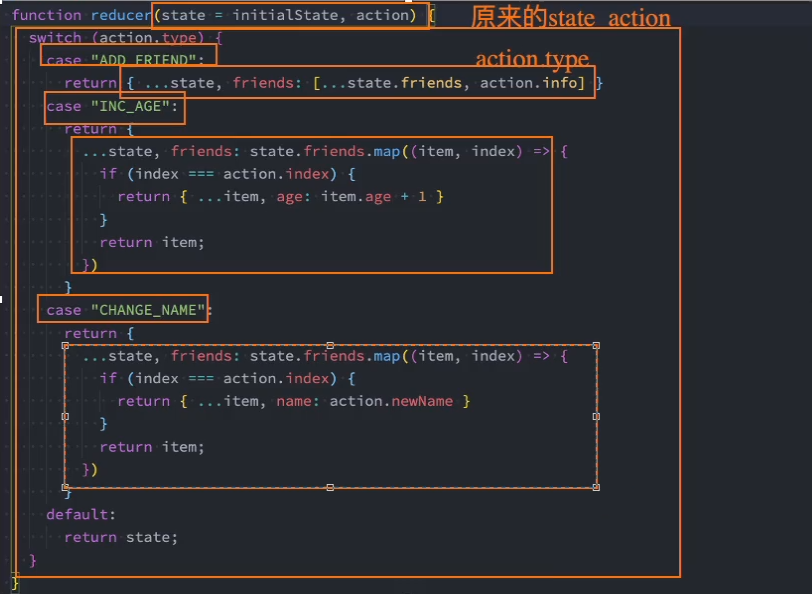

reducer 会：

1. 根据 action 对象中的 `type` 判断要怎么处理数据，
2. 通过 `switch` 选择对应的操作，
3. 对 state 进行操作，
4. 最后返回这个新的 state。


## 1.3 Redux 的三大原则

1. 单一数据源
   - 整个应用程序的 state 存储在一颗 object tree 中，并且这个 object tree 只存储在一个 store 中；
   - 创建多个 store 理论也可以，但是不利于数据的维护。单一数据源更方便管理 state。
2. state 是只读的
   - 修改 state 的唯一方式一通过 action。
   - 这样确保了 View 和网络请求都不能直接修改 state，只能通过 action 来描述自己想要如何修改 state；
   - 这样可以保证所以的修改都被集中化处理，都在 redux 的可监控、可管理的范围之内，并且按照严格的顺序来执行，所以不需担心 race condition（竞态）问题。

3. 使用纯函数来执行修改
   - 通过 reducer 将旧 state 和 action 联系在一起，并且返回一个新的 state；
   - 应用程序复杂度增加后，我们可以将 reducer 拆分成多个小的 reducers，分别操作不同 state tree 的一部分。
   - 所有的 reducer 都应该是纯函数，不能产生任何的副作用。


## 1.4 使用 Redux

不引入 React，在 Js 文件中使用 Redux。

基本模块：

1. 提前准备：
   - 导入 redux
   - 初始化数据
2. 定义 store
3. 定义 reducer
4. 定义 actions
5. 派发 action
6. 监听变化，定义`store.subscribe()`
   - 注意位置要放在 actions 之前。


```js
//1.导入 redux（不能通过 ES6 方式导入，node 有些版本不支持 ES6）
// commonjs 一种实现 -> node.js 导入
const redux = require("redux");

//定义一个初始化数据
const initialState = {
  counter: 0,
};

//[1]reducer
// 第一次使用，state 为 undefined，会使用默认的初始值 initialState
function reducer(state = initialState, action) {
  //不要对原state进行操作，而是拷贝一份后操作，返回新state。
  switch (action.type) {
    case "INCREMENT":
      return { ...state, counter: state.counter + 1 };
    case "DECREMENT":
      return { ...state, counter: state.counter - 1 };
    case "ADD_NUMBER":
      return { ...state, counter: state.counter + action.num };
    case "SUB_NUMBER":
      return { ...state, counter: state.counter - action.num };
    default:
      return state;
  }
}

//[2]store（创建的时候需要传入一个reducer）
const store = redux.createStore(reducer); //创建一个store，用来放数据

//订阅store的修改
//只要store中的state发生变化，就会调用该函数
store.subscribe(() => {
  // 通过store.getState()获取store中存储的state
  console.log("state发生了改变,counter:", store.getState().counter);
});

//[3]acitons
//action1/2：数字加1/减1
const action1 = { type: "INCREMENT" };
const action2 = { type: "DECREMENT" };
//action3/4，数字加5/减12
const action3 = { type: "ADD_NUMBER", num: 5 };
const action4 = { type: "SUB_NUMBER", num: 12 };

//派发action, store实际会调用reducer，然后执行相应的数据操作
store.dispatch(action1);
store.dispatch(action2);
store.dispatch(action3);
store.dispatch(action4);
```


## 1.5 Redux 结构划分（node）

对上面的基础 Redux 进行结构划分：

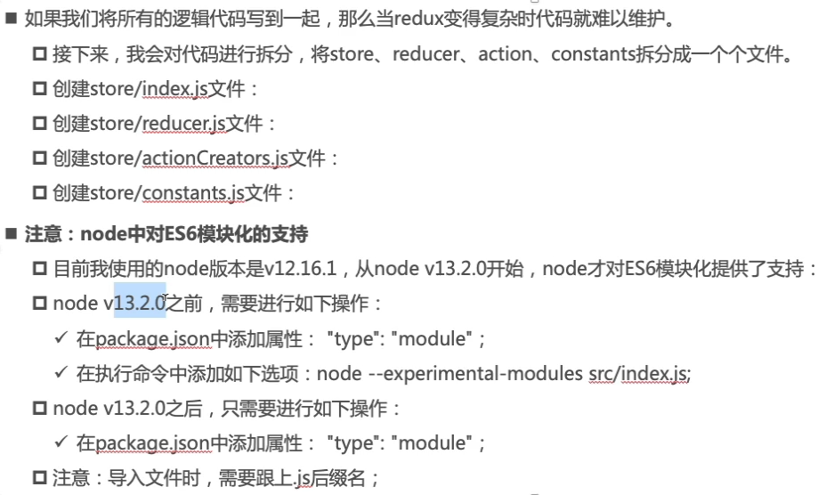


redux 的整体结构需要 4 个文件，如下：

- `store`		----------	存放 redux 结构的文件夹
  - `index.js`		----------	对外的入口，共 4 行：引入 redux、引入 reducer、创建 store、导出 store。
  - `constant.js`		----------	保存 action 操作的 **所有类型名 type**，方便查阅和修改。
  - `actionCreators.js`		----------	根据 type 定义对应的 action 函数、定义该 action 需要传递的参数。
  - `reducer.js`		----------	定义默认 state、创建 reducer。reducer 内是每个 action 的具体执行。
- `index.js`		----------	处理业务逻辑，监听数据变化，调用 `store.dispatch(someActions())`  处理数据


**Action 名称 和 type 操作类型，是一一对应关系。**

- 业务逻辑中，使用的是 Action 名称，redux 中，通过 Action 名称找到对应的 type 类型，然后执行操作。

使用 `node index.js` 就在 node 环境中使用 redux。

```js
// -------------- store 文件夹，有 4 个文件组成 redux --------------

// -------------- 1 index.js --------------
import redux from "redux";
import reducer from "./reducer.js";
const store = redux.createStore(reducer);
export default store;

// -------------- 2 constant.js --------------
export const ADD_NUMBER = "ADD_NUMBER";
export const SUB_NUMBER = "SUB_NUMBER";
export const DECREMENT = "DECREMENT";
export const INCREMENT = "INCREMENT";


// -------------- 3 actionCreators.js --------------
import { ADD_NUMBER, SUB_NUMBER, DECREMENT, INCREMENT } from "./constant.js";

export const addAction = (num) => ({
  type: ADD_NUMBER,
  num,
});

export const subAction = (num) => ({
  type: SUB_NUMBER,
  num,
});

export const deAction = () => ({
  type: DECREMENT,
});

export const inAction = () => ({
  type: INCREMENT,
});


// -------------- 4 reducer.js --------------
import { ADD_NUMBER, SUB_NUMBER, DECREMENT, INCREMENT } from "./constant.js";

const defaultState = {
  counter: 0,
};

function reducer(state = defaultState, action) {
  switch (action.type) {
    case ADD_NUMBER:
      return { ...state, counter: state.counter + action.num };
    case SUB_NUMBER:
      return { ...state, counter: state.counter - action.num };
    case DECREMENT:
      return { ...state, counter: state.counter - 1 };
    case INCREMENT:
      return { ...state, counter: state.counter + 1 };
    default:
      return state;
  }
}

export default reducer;

// -------------- index.js 使用 redux--------------
import store from "./store/index.js";
import {
  addAction,
  subAction,
  inAction,
  deAction,
} from "./store/actionCreators.js";

// 监听
store.subscribe(() => {
  console.log(store.getState());
}); 

// 派发
store.dispatch(addAction(10));
store.dispatch(addAction(15));
store.dispatch(subAction(8));
store.dispatch(subAction(5));
store.dispatch(inAction());
store.dispatch(deAction());
```


# 2 Redux 使用（react）

## 2.1 理论

下面会将 Redux 和 React 结合。

文章：[react-redux一点就透，我这么笨都懂了！ - 掘金 (juejin.cn)](https://juejin.cn/post/6844903602926927880)


使用流程：

当我们要对某个 Component 组件的 state 进行修改时，会发生如下流程：

1. **Central Store**。
   - 从 Central Store 出发，redux 中只会定义一个 store 用来存储整个项目中的数据。

1. **Subscription**。 

   - 在这个 Component 的 `componentDidMount()` 组件加载完毕的回调中，添加 `store.subscribe()`  订阅。也就是一旦 store 中的数据发生变化，就会调用这个监听函数。

   - 当用户发生对数据修改的行为（点击按钮、输入表单等等），就会触发 `Dispatches`，Store 中的数据就会发生改变，进而我们设定的 subscribe 订阅监听就会被触发。
   - 在 Subscription 中添加 `this.setState()` ，把 store 中变化的数据，更新到这个 Component 组件中的 state 。
   - 此时 React 会更新组件的 state，并触发 `render()` 去重新渲染页面，呈现新数据。

2. **Component**。
   - 通过在组件的 `componentDidMount()` 中订阅  `this.setState()` ，就会让这个组件自身的 state 随着 store 中的 state 变化而保持最新。也就是说，store 中会保存全部需要共享的数据，组件会额外的保存一份 store 中自己需要的数据。
   
   - 同时在组件中的 `button` 按钮定义触发事件，一旦触发，就使用 Dispatches 派发 Action，去更新 store 中的数据。
   
3. **Action**。
   - Actions，是提前定义好的多种对数据的操作方法。
   - 在这里定义 Dispatch 派发时， 同时指定要执行的 action 名称以及传入对应的操作参数。
   
4. **Reducer**。
   - Redux 通过 Reducer 把数据修改。 
   - reducer 收到需要操作的 state 和 操作方法 action，根据 `action.type` ，对数据进行操作。最后返回一个新的 state。
   - Redux 会把这个 state 更新到自己的 store 中。
   
5. 进入一个新的循环，一旦 store 发生改变就会被订阅到，然后调用 `this.setState()` 同步更新组件的 state，最后


## 2.2 不同

第 1.5 节已经把 redux 进行了结构划分，store 文件夹中有 4 个文件，分别控制不同的模块。

与 node 环境唯一不同的是，index.js 的引入 redux 要作如下修改：

```js
// node中是:
// import redux from "redux";
// const store = redux.createStore(reducer);

import { createStore } from "redux";
import reducer from "./reducer.js";
const store = createStore(reducer);
export default store;
```


## 2.3 把相同的逻辑放到一起

比如在例子中，page 文件下的两个组件 about 和 home 中有非常多相似的代码，可以提取出来放在一个文件中。

 

把 home 和 about 组件中，不一样的部分抽离出去，把相同的部分放到一起。

在 utils 文件中，建立一个 `connect.js` 和 `context.js` 。其中 `connect(mapStateToProps, mapDispatchToProp)` 函数，链接着 redux  和 component，通过 props 把数据和方法传递给 about 和 home 组件。

- 依赖 state 
- 依赖 dispatch

内容在 16.React Hooks（二）15:00 讲述。

- 高阶组件 `context` 部分没有太明白，还没听。
- `const StoreContext = React.createContext();`


综上，目前看不懂没关系，有一个封装好的库，等效 `connect`  和 `context`：`redux-react`

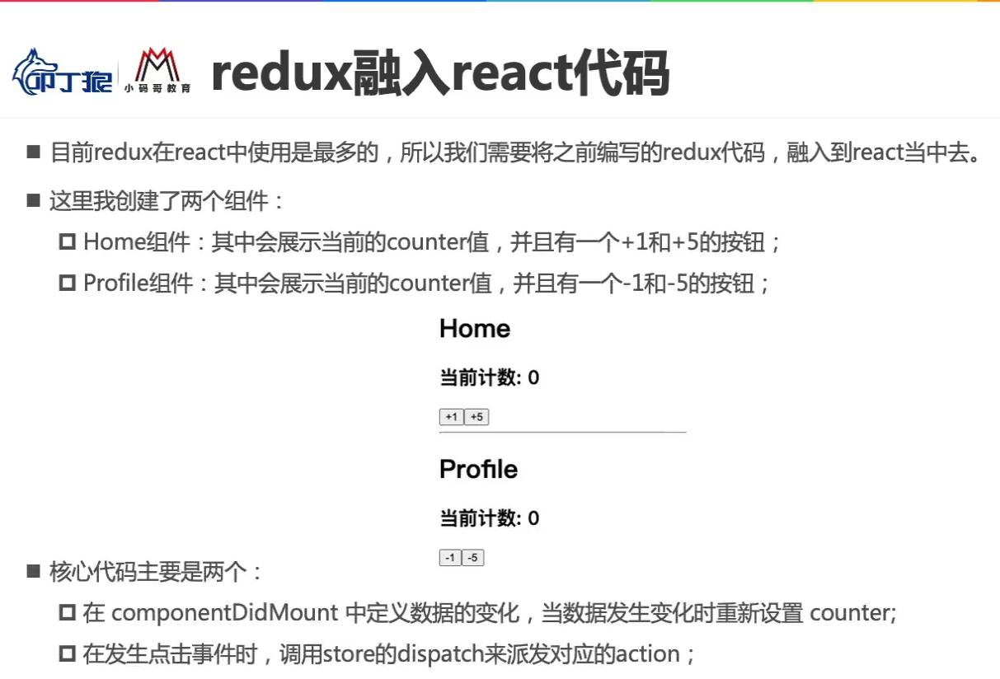

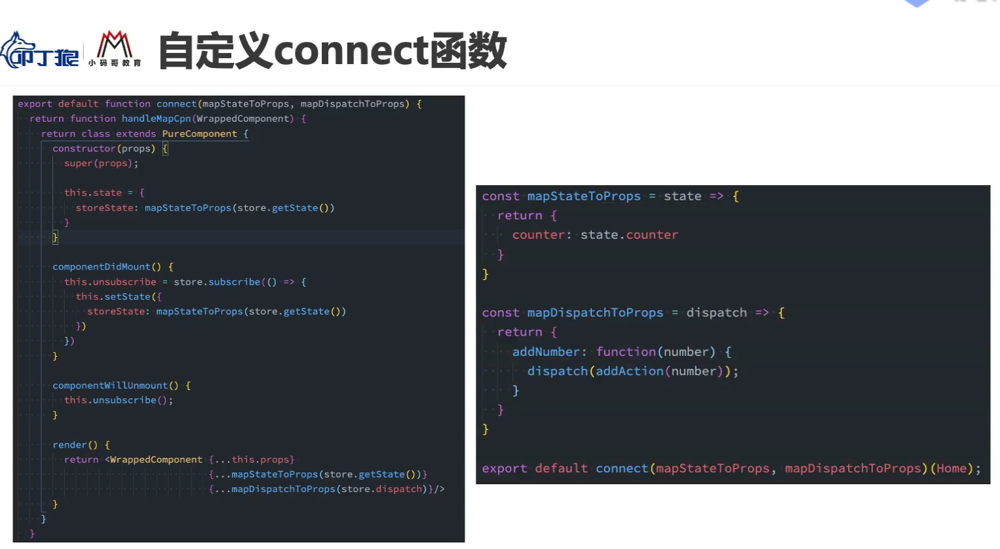

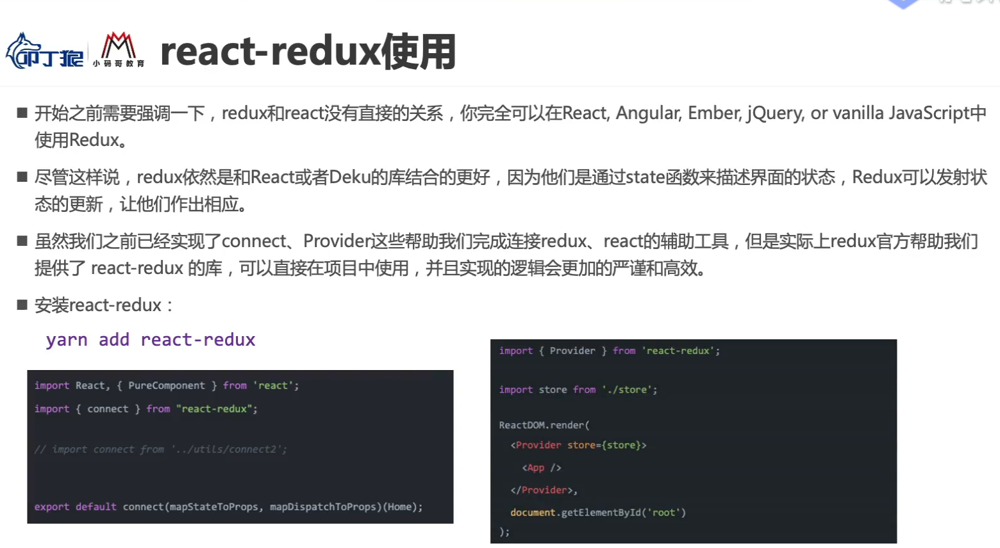


### 【重要】react-redux 原理

下图是基本逻辑：

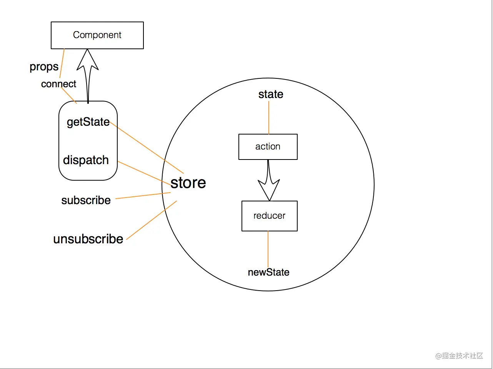


## 2.4 中间件 — 组件中的异步操作

- 老师服务器的接口：http://123.207.32.32:8000/home/multidata

### 组件中异步操作

- 在之前简单的案例中，`redux`中保存的`counter`是一个本地定义的数据
  - 我们可以直接通过同步的操作来`dispatch action`，`state`就会被立即更新。
  - 但是真实开发中，`redux`中保存的**很多数据可能来自服务器**，我们需要进行**异步的请求**，再将数据保存到`redux`中
- 网络请求可以在`class`组件的`componentDidMount`中发送，所以我们可以有这样的结构:

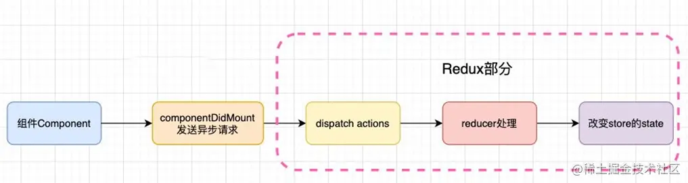

### redux中异步操作

- 上面的代码有一个缺陷：
  - 我们必须将**网络请求**的异步代码放到组件的生命周期中来完成
- 为什么将网络请求的异步代码放在`redux`中进行管理?
  - 后期代码量的增加，如果把网络请求异步函数放在组件的生命周期里，这个生命周期函数会变得越来越复杂，组件就会变得越来越大
  - 事实上，**网络请求到的数据也属于状态管理的一部分**，更好的一种方式应该是将其也交给`redux`来管理

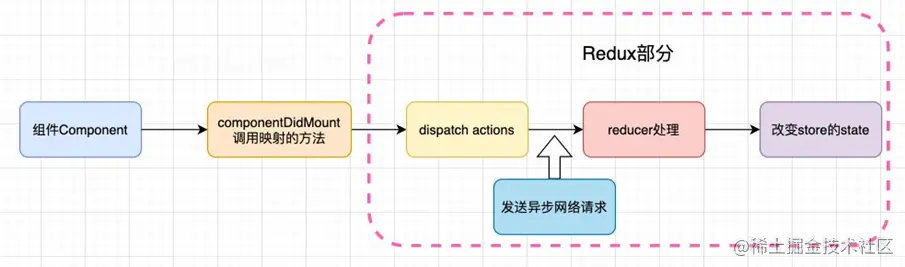

- 但是在 redux 中如何可以进行异步的操作呢？
  - **使用中间件 (Middleware)**
  - 学习过 `Express` 或 `Koa` 框架的童鞋对中间件的概念一定不陌生
  - 在这类框架中，`Middleware`可以帮助我们在 **请求和响应之间嵌入一些操作的代码** ，比如 cookie 解析、日志记录、文件压缩等操作


### 理解中间件(重点)

- redux 也引入了中间件 (Middleware) 的概念：
  - 这个**中间件的目的是在`dispatch`的`action`和最终达到的`reducer`之间，扩展一些自己的代码**
  - 比如日志记录、**调用异步接口**、添加代码调试功能等等

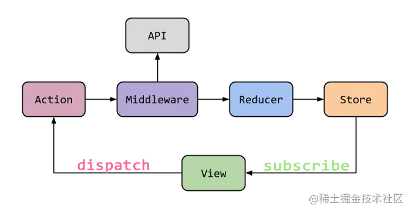

#### 1 异步action和普通的action有什么不同？

普通 action 返回的是对象，但是异步 action 返回的是一个函数。

```jsx
// 同步action
export const decrement = (number) => ({type: DECREMENT,data: number});

// 异步增加的action
export const incrementAsync = (number) => {
    return dispatch => {
        setTimeout(() => {
            dispatch({type: INCREMENT,data: number})
        },1000)
    }
}
```


#### 2 `redux-thunk` 是如何做到让我们可以发送异步的请求呢？

- 默认情况下的`dispatch(action)`，`action`需要是一个 `JavaScript` 的对象
- `redux-thunk` 让 `dispatch(action())` 中的 `action()` 原本是返回一个值，现在可以 **返回一个函数**
- 该函数会被调用，并且会 **自动的** 传给这个函数两个参数：`dispatch` 方法 +  `getState` 方法。
  - 这使得这个函数内部可以使用 `dispatch` 更新数据、使用 `getState` 获取数据
    - `dispatch` 方法：用于我们之后再次派发 `action`；
    - `getState` 方法：考虑到我们之后的一些操作需要依赖原来的状态，用于让我们可以获取之前的一些数据；


### redux-thunk 的使用

1. 安装 `redux-thunk`
   - `yarn add redux-thunk`
2. 在创建 `store` 时传入应用了 `middleware ` 的 `enhance` 函数
   - 通过 `applyMiddleware` 来结合多个 `Middleware`，返回一个 `enhancer`；
   - 将 `enhancer ` 作为第二个参数传入到 `createStore` 中；

 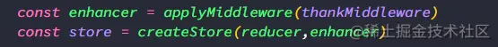

3. 定义返回函数的 `action`，

- 注意：这里不是返回一个对象了，而是一个 **函数**；
- 该函数在 `dispatch` 之后会被执行；

 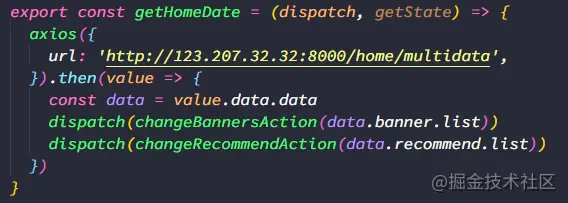


使用 thunk：

```jsx
import { createStore, applyMiddleware } from 'redux'
import reducer from './reducer'
import thunk from 'redux-thunk'
const store = createStore(
  reducer,
  applyMiddleware(thunk) // applyMiddleware可以使用中间件模块
) 
export default store
```


## 2.5 redux-devtools

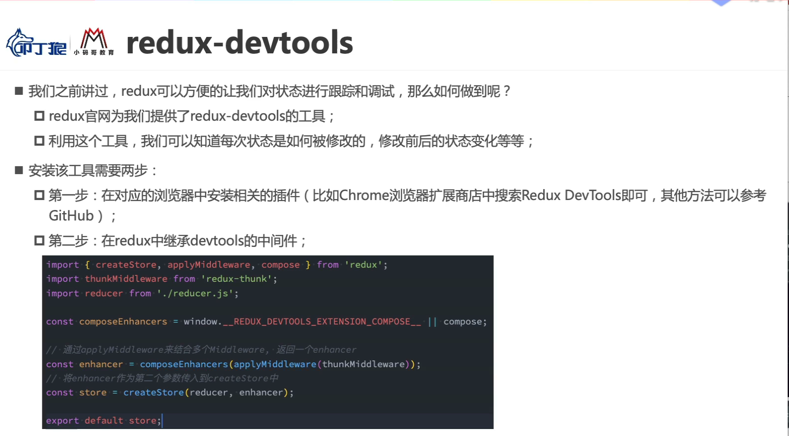

## 2.6 redux-saga 中间件

- 暂时跳过，用到的话就学

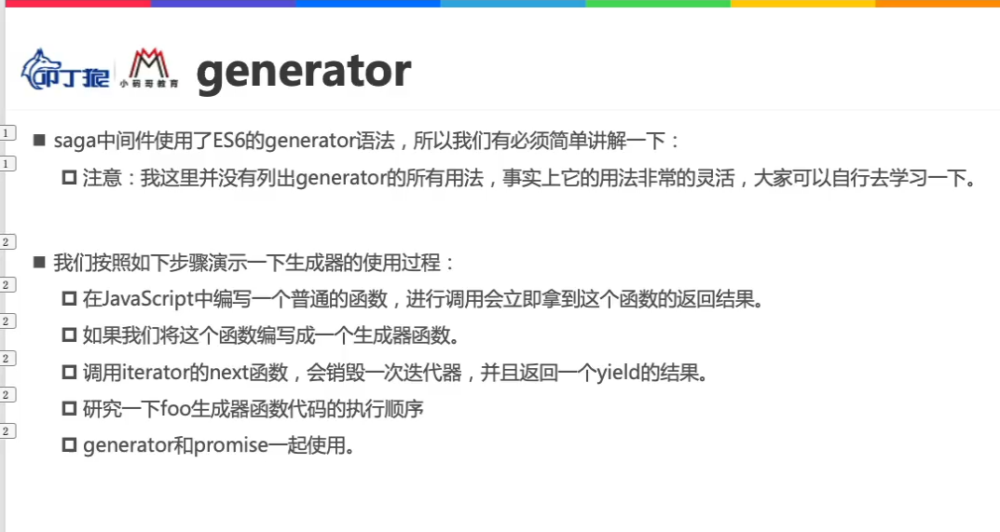

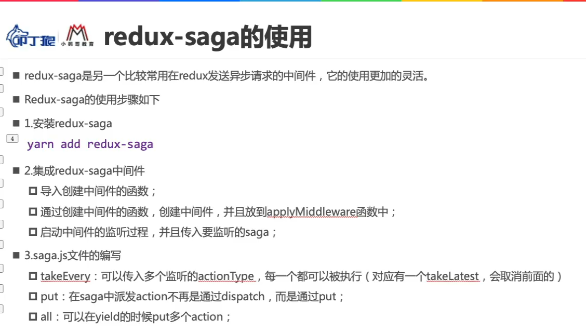

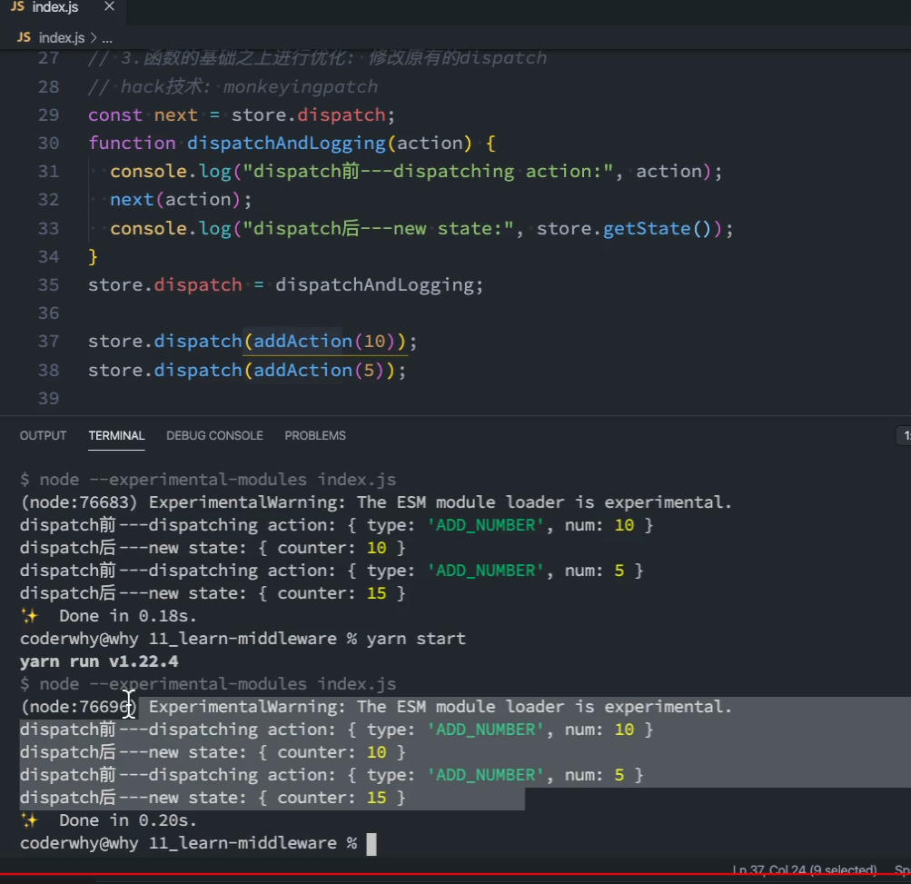


## 2.7 reducer 的拆分

### 2.7.1 为什么叫 reducer？

因为 reducer 的原型是 JavaScript 中的 `Array.prototype.reduce()` 方法：

reduce 的语法：

```js
[1,2,3,4,5].reduce((preValue, item), initialValue) => {
    // 操作
}
```

reduce 的回调方法，就被称之为一个 reducer。它具体表现是这样的：

1. 每次调用 reducer 前，都会获取一个原有的 preValue 值。
2. 需要传入 item 来修改 preValue。
3. 最后返回修改后的值。
4. 如果没有传入 preValue，还可以设置一个默认值 initialValue。


与之相比，redux 中的 reducer 是这样的：

```js
function reducer(state = defaultState, action) {
  switch (action.type) {
    case ADD_NUMBER:
      return { ...state, counter: state.counter + action.num };
    case SUB_NUMBER:
      return { ...state, counter: state.counter - action.num };
    case DECREMENT:
      return { ...state, counter: state.counter - 1 };
    case INCREMENT:
      return { ...state, counter: state.counter + 1 };
    case CHANGE_BANNERS:
      return { ...state, banners: action.banners };
    case CHANGE_RECOMMEND:
      return { ...state, recommends: action.recommends };
    default:
      return state;
  }
}
```

如果开头写成箭头函数：

```js
(state = defaultState, action) => {
    // 操作
}
```

可以看到，它和 reduce 非常的相似：

1. 每次调用 reducer 前，需要获取一个原有的值 state；
2. 需要传入 action 里面保存了对旧 state 需要删改的操作；
3. 最后返回修改后的新 state；
4. 如果没有传入 state，就会有一个默认的 defaultState 传入。


## 2.7.2 为什么要拆分 reducer

如果项目对数据的操作：

1. 条目非常多，可能有上千行，reducer 非常长；
2. 对数据的操作有明显的类别，如异步网络申请数据、本地数据、不同的组件数据等。

```js
// 拆分 counterReducer
const initialCounterState = {
  counter: 0,
};
function counterReducer(state = initialCounterState, action) {
  switch (action.type) {
    case ADD_NUMBER:
      return { ...state, counter: state.counter + action.num };
    case SUB_NUMBER:
      return { ...state, counter: state.counter - action.num };
    case DECREMENT:
      return { ...state, counter: state.counter - 1 };
    case INCREMENT:
      return { ...state, counter: state.counter + 1 };
    default:
      return state;
  }
}

// 拆分 homeReducer
const initialHomeState = {
  banners: [],
  recommends: [],
};
function homeReducer(state = initialHomeState, action) {
  switch (action.type) {
    case CHANGE_BANNERS:
      return { ...state, banners: action.banners };
    case CHANGE_RECOMMEND:
      return { ...state, recommends: action.recommends };
    default:
      return state;
  }
}

function reducer(state = {}, action) {
  return {
    counterInfo: counterReducer(state.counterInfo, action),
    homeInfo: homeReducer(state.homeInfo, action),
  };
}

export default reducer;
```

- 改变了 redux 中 state 的结构

```js
//之前的结构：
state = {
    counter: 0,
    banners: [......],
    recommders: [......],
}

//之后的结构：
state = {
    counterInfo: {
        counter： 0,
    },
    homeInfo: {
        banners: [......],
        recommders: [......],
    }
}
```

其实有一个官方的库 combinReducers 可以实现多个 reducer 的合并


## 2.8 管理 state

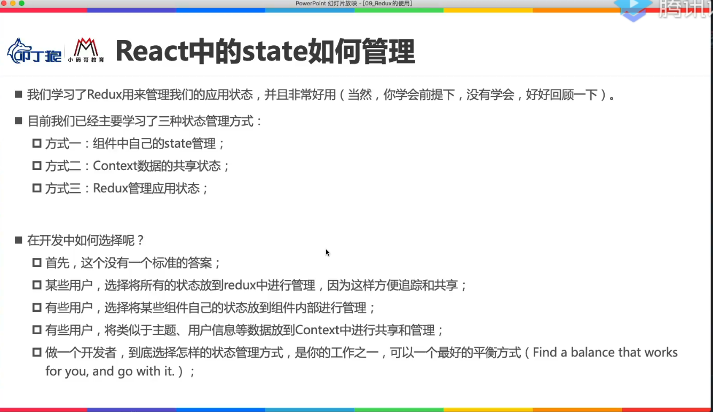


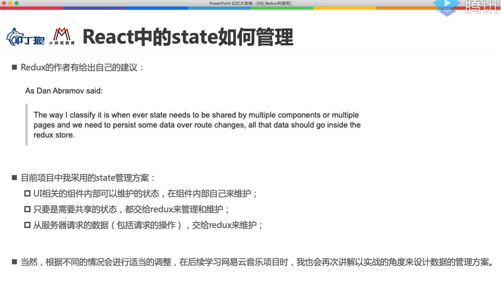

## 2.9 单向数据流

有三个理解：

1. React 官网中有提到单向数据流：
   - 只的就是通过 props 进行数据传递。一个项目中，组件是按以树的结构组织起来的。上层的组件可以通过  props 向下层组件传递数据。也就是父组件可以单向的向子组件传递数据。
2. Vue 和 React 中，每个组件内部也有一个单向数据流：
   - 一个组件从功能的实现上看，有三个模块：
     1. UI，组件最终展示的数据和界面；
     2. action，对组件中数据的操作方式，比如增删改等操作；
     3. State，组件数据保存的地方，组件的状态。
   - 所以，在 UI、action、State 之间也是按照单向数据流传递的：
     - 在 UI 页面中，用户通过交货产生了对数据的操作，触发 action；
     - React 接收到特定的 action 操作，进而对组件的 State 进行修改；
     - 组件的 State 一旦发生变化，就会触发 `render()` 重新渲染 UI ，页面发生变化。
3. Redux 中，对数据的操作也是一个单项数据流：
   - 一个 Store 从对数据的操作来看，有 3 个模块：
     1. UI，组件最终展示的数据和界面；
     2. Dispatch，组件中对数据的操作方式，比如增删改等操作；
     3. Store，组件中保存数据的地方。
        - Reducer，Store 中保存对数据操作的地方。Dispatch 触发 Reducer ，完成对数据的操作。
        - State，Store 中保存数据的地方。
     4. 所以，数据在UI、Dispatch、Store（Reducer、State）中也是一个单项数据流：
        - 用户通过 UI 界面触发事件，引发 Dispatch 派发申请对数据进行操作；
        - Dispatch 调用 Store 中的 Reducer，通过携带的 action 识别 Reducer 中对应的操作。然后修改数据；
        - 修改后的数据会更新 Store 中的 State。
        - 数据更新完毕后，会通知 React 组件，最终 `render()` 重新渲染 UI 界面。


2. 组件内部的单项数据流。


3. Redux中的单向数据流。


# 3 Router

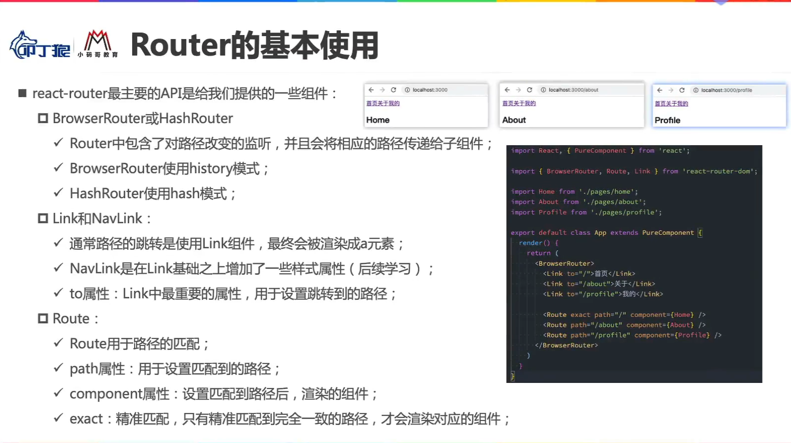


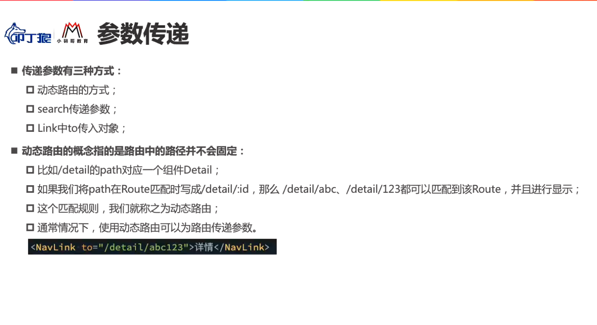

路由管理不仅可以用一个长串的 `<Switch></Switch>` 管理，还可以用一个文件夹 router，利用 react-router-config 包进行管理。

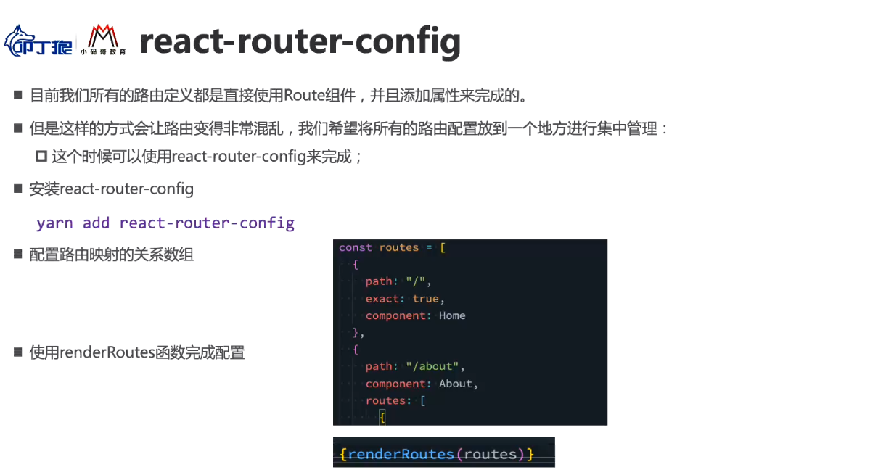


# 4 React Hooks

20.综合项目实战（四）开始讲述。

## 4.1 Hooks 的优缺点

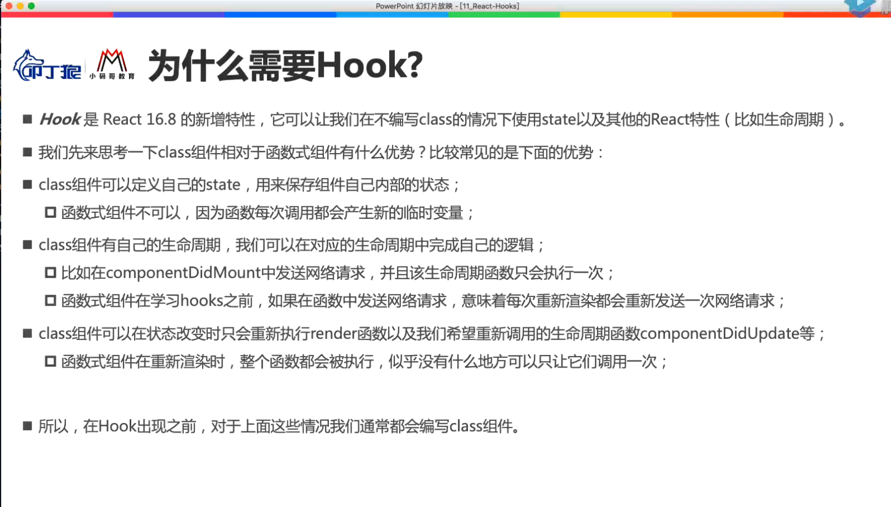


  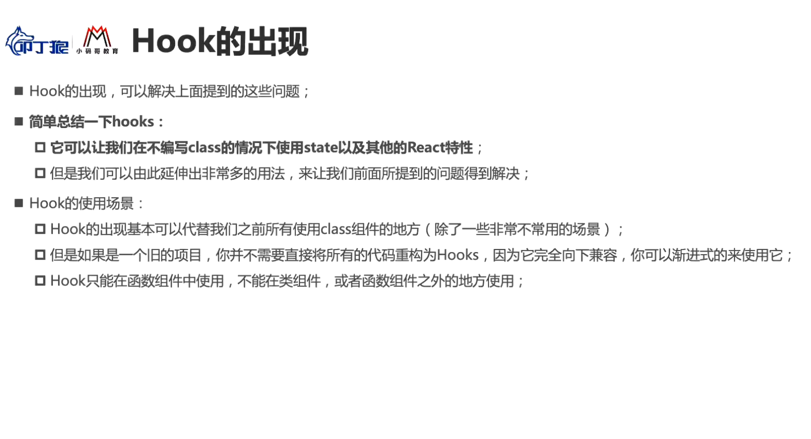

## 4.2 使用基础 hooks

### 1 State Hook

- 本身是一个函数，来自 react 包

- 有参数和返回值
  - 参数：作用是给创建出来的 state 状态一个默认值。
  - 返回：一个数组，包含两个成员：当前状态 state 对象 + 操作状态的函数

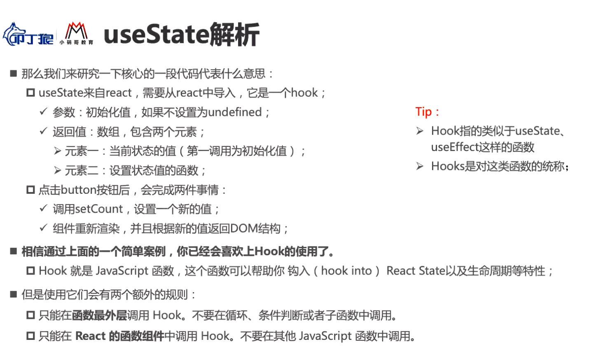

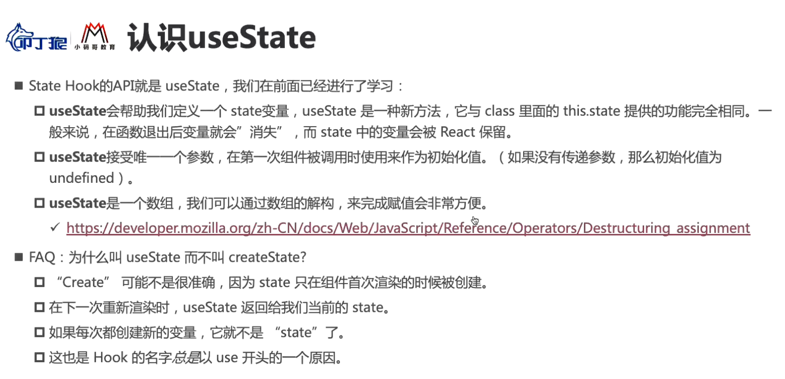

```jsx
import React, { useState } from "react";

export default function CounterHook() {
  //2 解构赋值
  const [count, setCount] = useState(0);
  return (
    <div>
      <h1>当前计数：{count}</h1>
      <button onClick={(e) => setCount(count + 1)}> +1 </button>
      <button onClick={(e) => setCount(count - 1)}> -1 </button>
    </div>
  );
}

```

上图是一个函数组件，其显示的页面如下：


当我们点击 +1 或者 -1 的时候。会重新执行一次 `function CounterHook()` 方法中的代码，也就是完全的重新执行一次函数式组件。

1. 每次调用该方法，都会通过 useState，获取当前组件的 state 状态；
2. 然后根据新的 state 值，渲染页面。
3. 该数组中的 state 会被 React 保存下来，每次调用时取出。


`setState` 函数可以有两种用法，参数：

1. 直接传入更新后的数值；
2. 传入一个方法，这个方法会携带之前的数值，进行操作后再返回新数值。

他们的区别是，如果多个 `setState` 连续使用。直接传入数值会发生合并，只有一个 `setState`起作用；而如果传入的是函数，就会全部起作用：

```jsx
//方式一，四个setCount会发生合并，最终结果只 +10
function handleBtnClick1() {
    setCount(count + 10);
    setCount(count + 10);
    setCount(count + 10);
    setCount(count + 10);
}

//方式二，四个setCount不会合并，最终结果 +40
function handleBtnClick2() {
    setCount((prevCount) => prevCount + 10);
    setCount((prevCount) => prevCount + 10);
    setCount((prevCount) => prevCount + 10);
    setCount((prevCount) => prevCount + 10);
}

<button onClick={handleBtnClick1}>+40</button>
<button onClick={handleBtnClick2}>+40</button>
```


### 2 Effect Hook

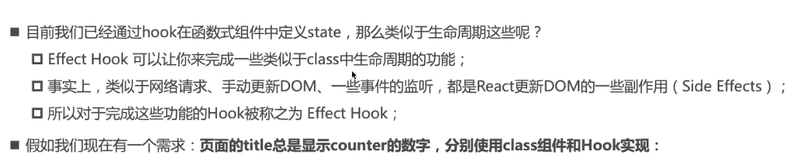

#### 2.1 基本使用

只要组件调用被重新渲染，就会触发 `useEffect` 的第一个参数：

- 第一个参数是一个回调函数。

```jsx
//在函数组件中使用 hooks
useEffect(()=>{
    console.log("订阅一些事件")
    console.log(“只要组件重新渲染就会调用这里，相当于componentDidMount+componentDidUpdate”)
    
    return ()=>{
        console.log("取消订阅事件")
        console.log("在卸载组件前，或重新渲染组件前，都会调用这里")
    }
})

//给useEffect添加了第二个参数，一个空数组
useEffect(()=>{
    console.log(“组件第一次渲染调用这里，相当于componentDidMount”)
    
    return ()=>{
        console.log("取消订阅事件")
        console.log("在卸载组件前调用这里,相当于componentWillUnmount")
    }
},[])
```

#### 2.2 多个useEffect一起使用

以前在组件 `componentDidMount` 内部会非常繁杂，有对事件监听的代码、有网络请求资源的代码、也有修改 DOM 的代码等等。

可以定义多个  `useEffect`  函数，每个 `useEffect` 都有不同的使用逻辑，它们因作用域的限制互不干扰。这样代码也更可读。

- React 会按照 `useEffect` 定义的顺序来顺序执行。  

#### 2.3 第二个参数

- `useEffect()` 第二个参数是一个数组。

  数组成员是变量，只有变量发生改变，才会执行 `useEffect()` 

- 如果传入变量 `counter` 表示这个 `useEffect` 的执行依赖 `state` 中的 `counter` 变量。该函数在第一次渲染的时候一定会执行一次，后续只有 `counter` 变量发生改变，才会执行。

- 如果传入空数组 `[]` 表示这个 `useEffect` 的执行不依赖任何变量。这就表示该函数只会在第一次渲染的时候执行一次，之后不会再执行。相当于 `componentDidMount`。


### 3 Context Hook


 使用 Context Hook就可以解决使用时层层嵌套的这个问题：

在外层组件中：

```jsx
// 1 引入 createContext 方法
import React, { createContext } from "react";
//...
// 2 创建并导出需要共享的 context。
export const UserContext = createContext();
export const ThemeContext = createContext();

// 3 在外层组件内，利用 <XxxxContext.Provider> 对需要共享context的多个组件进行包裹
export default function App() {
  return (
    <div>
      {/* 4. context Hook 使用 */}
      <UserContext.Provider value={{ name: "Moxy", age: 18 }}>
        <ThemeContext.Provider value={{ fontsize: "30px", color: "red" }}>
          <Father1 />
          <Father2>
              <Child1 />
          </Father2>
        </ThemeContext.Provider>
      </UserContext.Provider>
    </div>
  );
}
```

在内层的任意一个组件中，不论是 Father 还是嵌套在内部的 Child：

```jsx
// 1 引入 useContext 方法
import React, { useContext } from "react";
// 2 引入共享的两个 context
import { UserContext, ThemeContext } from "../App";

export default function ContextHook() {
// 3 获取context内的数据
  const user = useContext(UserContext);
  const theme = useContext(ThemeContext);

  console.log(user, "&", theme);
// {name: 'Moxy', age: 18} '&' {fontsize: '30px', color: 'red'}
// 正确获取了值。
    
    return <div>我是 Child 组件</div>;
}
```


## 4.3 使用扩展 hooks

### 3.1 useReducer

1. useReducer 是 useState hooks 的扩展。在逻辑相对复杂的情况下，可以用 reducer 的 switch 进行判断。
2. 如果多个组件均有一个相同的判断方式（可以用同一个 switch 判断），那么单独定义一个 reducer 纯函数，然后不同的组件 import 引入这个 reducer 即可。

使用1：在一个组件中使用 reducer：

```jsx
// 1 引入 useReducer
import React, { useReducer } from "react";

// 2 定义 reducer方法，这个方法接收两个参数：要操作的数据 state，操作的方法名称 action
function reducer(state, action) {
  switch (action.type) {
    case "increment":
      return { ...state, counter: state.counter + 1 };
    case "decrement":
      return { ...state, counter: state.counter - 1 };
    default:
      return;
  }
}

export default function Home() {
 // 3 创建一个 Reducer，输入两个参数：一个reducer方法，一个数据对象，
 // 	useReducer 会返回两个结构：
    // 		1. 存放数据的 state 对象，保存的就是 {counter:0}，
    //		2. 触发 action 的方法，dispatch，使用 dispatch 来操作 state。
  const [state, dispatch] = useReducer(reducer, { counter: 0 });

  return (
    <div>
      <h2>Home当前计数：{state.counter}</h2>
{/* 4 对state进行操作，通过调用 dispatch()方法，传入action对象，成员有操作的方法名称type。*/}
    {/*  React会拿着方法名称 action.type在reducer纯函数中重找对应的操作方法，然后更新state*/}       
      <button onClick={(e) => dispatch({ type: "increment" })}>+1</button>
      <button onClick={(e) => dispatch({ type: "decrement" })}>-1</button>
    </div>
  );
}
```


使用2：多个组件共用一个 reducer：

- 需要注意的是，这里的 `useReducer` 只是对 `useState` 的一种特殊用法。使用方式类似了 redux 中的 reducer。但是 `useReducer` 是无法共享 state 数据的，和 redux 也毫无关系。唯一可以共享的只是 `reducer` 纯函数，操作 state 的方法。

```jsx
// reducer.js
// 导出一个 reducer 纯函数
export default function reducer(state, action) {
    switch(action.type) {
        case "increment":
            return {...state, counter: state.counter + 1};
        case "decrement":
            return {...state, counter: state.counter - 1};
        default:
            return state;
    }
}


// home.js
// Home 组件等其他组件可以共用这个方法
import React, { useReducer } from "react";
// 引入 Reducer 纯函数
import reducer from './reducer'

export default function Home() {
  const [state, dispatch] = useReducer(reducer, { counter: 0 });

  return (
    <div>
      <h2>Home 当前计数：{state.counter}</h2>
      <button onClick={(e) => dispatch({ type: "increment" })}>+1</button>
      <button onClick={(e) => dispatch({ type: "decrement" })}>-1</button>
    </div>
  );
}


// about.js
// About 组件等其他组件可以共用这个方法
import React, { useReducer } from "react";
// 引入 Reducer 纯函数
import reducer from './reducer'

export default function About() {
  const [state, dispatch] = useReducer(reducer, { counter: 0 });

  return (
    <div>
      <h2>About 当前计数：{state.counter}</h2>
      <button onClick={(e) => dispatch({ type: "increment" })}>+1</button>
      <button onClick={(e) => dispatch({ type: "decrement" })}>-1</button>
    </div>
  );
}
```


### 3.2 useCallback

- 实际目的是为了性能优化。用于 **子组件需要向父组件传递信息，所以通过调用父组件 props 传递的回调函数来实现** 时使用。
- 换句话说，就是缓存了父组件传递给子组件的一个【回调方法】。

如何进行优化?

1. useCallback会返回一个函数的 memoized（记忆的）值；
2. 在依赖不变的情况下，多次定义的时候，返回的值是相同的。
   - 只有定义的依赖发生改变，返回的值才会改变。

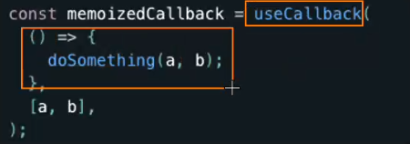


useCallBack 的使用：

```jsx
const increment2 = useCallback(() => {
    console.log("执行increment2函数");
    setcount(count + 1);
}, [count]);
```

- 只要依赖 `count` 变量发生变化，useCallBack 就会返回一个新的值，useCallBack 参数中的回调函数会被 **重新定义**，也就是说 increment2 会被重新定义。
- 但是，如果 `count` 变量没有发生变化，useCallBack 就会返回一个相同的值。increment2 不会被重新定义。


#### 情况二：有效使用

useCallback 有性能优化：

useCallback 在什么时候使用？

场景：在将一个组件中的函数传递给它的子组件，进行回调使用时，使用 useCallback 对函数进行处理。这样这个回调函数就不会轻易的进行重新渲染了：

**实例代码：**

```jsx
import React, { useState, useCallback, memo } from "react";

// 创建一个子组件
const HYButton = memo((props) => {
  console.log("HYButton重新渲染：" + props.title);
  return <button onClick={props.increment}> {props.title}:HYButton +1 </button>;
});

// 父组件
export default function CallbackHookDemo02() {
  console.log("CallbackHookDemo02 重新渲染");

  const [count, setcount] = useState(0);
  const [show, setShow] = useState(true);

  const increment1 = () => {
    console.log("执行increment1函数");
    setcount(count + 1);
  };

  const increment2 = useCallback(() => {
    console.log("执行increment2函数");
    setcount(count + 1);
  }, [count]);

  return (
    <div>
      <h2>CallbackHookDemo01</h2>
      <HYButton title="btn1" increment={increment1} />
      <HYButton title="btn2" increment={increment2} />

      <h2>{count}</h2>
      <button onClick={(e) => setShow(!show)}>show切换</button>
    </div>
  );
}
```

**效果：**

 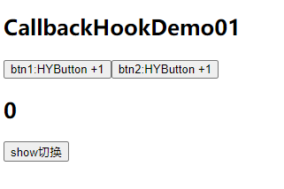

**逻辑结构：**

1. 有两个组件，一个 CallBackHookDeo02 父组件，一个 HYButton 子组件；
2. 父组件保存了两个状态，`count` 和 `show`，
   - 当点击一次 “+1” 按钮时，`count` 数字会 +1
   - 当点击 “show切换” 按钮时，`show` 会进行 `true` 和 `false` 的值转换。
3. 有两个 “+1” 的按钮，它们是 HYButton 子组件渲染的。当用户点击 `HYButton` 渲染的按钮时，`HYButton` 会调用父组件通过 `props` 传递过来的 `increment` 函数，然后对父组件的 `count` 方法 +1。
4. 这两个 HYButton 的不同：
   - `btn1：HYBUtton + 1` ，这个按钮通过 `props` 传递过来的函数是 `increment1`。这个函数 **没有使用**  useCallback 包裹。
   - `btn2：HYBUtton + 1` ，这个按钮通过 `props` 传递过来的函数是 `increment2`。这个函数 **使用了** useCallback 包裹。


**交互：**

情况一：当点击 btn1: HYButton + 1 按钮时，输出：

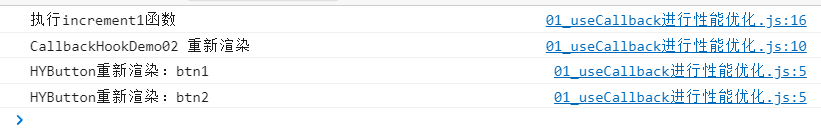

情况二：当点击 btn1: HYButton + 2 按钮时，输出：

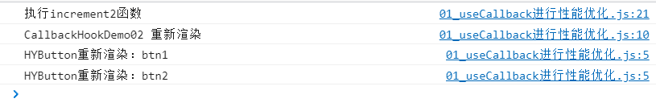

情况三：当点击 show切换 按钮时，输出：

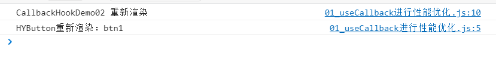

可以看到， btn1: HYButton + 1 和 btn1: HYButton + 1 的点击，都会导致 count 的变化，而 count 的变化，就会导致父组件 CallBackHookDeo02 的重新渲染。然后 CallBackHookDeo02 中的 increment1 和 increment2 就会重新定义。

- increment2 虽然包裹了 useCallback，但是第二个参数我们传递的依赖是 count，也就是说，count 发生变化，useCallback 就会执行其中的回调函数，给左侧的 increment2 返回一个新的值。


**情况一和情况二的执行顺序：**

1. 如果点击 `btn1`，回调函数 `increment1` 函数就会被调用。输出其内容：`执行increment1函数`；
2. 执行 `increment1` 函数，改变了 `count` 的值，引发父组件的重新渲染，执行组件中的代码被重新执行，输出：`CallbackHookDemo02 重新渲染`。
3.  此时 `increment1` 和 `increment2` 也因此被重定义。
4. 而 `memo()` 通过对比子组件传递过来的 props 和 state，发现 `props.increment` 发生了变化（这个函数在父组件中被重定义了）。所以子组件也重新渲染，子组件中的定义代码也被执行了，就会按顺输出：
   - `HYButton重新渲染：btn1` 和 `HYButton重新渲染：btn2`


**前置知识：**

父组件渲染，子组件也一定会渲染。

 如果希望父组件发生渲染时，如果子组件在其内部没有 state 和 props 变化，就节约开销不发生渲染，就采取：

- 类组件中：组件继承 `PureComponent` 类，快捷键 `rpc`；
- 函数组件中：组件用 `memo()` 包裹。


进一步说，如果我们希望子组件中，`state` 和 `props` 变化受影响的回调函数，需要进行重定义。而不受影响的回调函数，我们希望不要重定义，这是时候就可以使用 `useCallBack`。

- 先用 `memo()` 包裹这个函数组件；
- 再用 `useCallBack` Hook。


**情况三的执行顺序：**

1. 当点击 “show切换” 时，调用 setShow 会改变 show 的布尔值 true 和 false。 show 的值发生改变会，导致父组件的重新渲染，输出：`CallbackHookDemo02 重新渲染`。
2. 此时，`increment1` 函数被重新定义了，而 `increment2` 函数包裹了 useCallback 没有重新定义。这是因为，increment2 的重定义，需要依赖传入的第二个参数，`count`变量发生改变。如果 count 没有变化，就不会重定义 increment2。
3. 因此，通过 memo 包裹的子组件 HYButton：
   1. btn1 传递过来的 props.increment 是 increment1，被重定义了。所以这个子组件会重新渲染，执行并输出：`HYButton重新渲染：btn1` ；
   2. btn2 传递过来的 props.increment 是 increment2，没有重定义。也就是前后两次 props.increment 保存的是同一个地址值。所以并不会引发这个子组件的重新渲染，没有执行其中的输出表达式。


#### 情况一：无效使用

useCallback 没有性能优化：

```jsx
import React, { useState, useCallback } from "react";

export default function CallbackHookDemo01() {
  const [count, setcount] = useState(0);

  const increment1 = () => {
    console.log("执行increment1函数");
    setcount(count + 1);
  };

  const increment2 = useCallback(() => {
    console.log("执行increment2函数");
    setcount(count + 1);
  }, [count]);

  return (
    <div>
      <h2>CallbackHookDemo01</h2>
      <button onClick={increment1}> +1 </button>
      <button onClick={increment2}> +1 </button>
      <h2>{count}</h2>
    </div>
  );
}
```

每次点击 `button`，都会触发 count 的改变，state 值一旦发生改变，就会引发父组件的重新渲染。组件一旦要重新渲染，就会导致重新定义局部变量和局部属性，也就是执行函数组件中的各种代码。

因此：

1.  `increment1` 函数被重新定义。
2.  `increment2` 嵌套了一个 useCallback，但是函数内部要对 count 进行操作，因为作用域的问题，**必须** 对操作的变量进行传参，count **必须** 通过 useCallback 的第二个参数传递进来，才能用 setcount 正确修改。而正是因为传递了 count 参数，使 useCallback 的第一个回调函数参数形成了依赖。—— 如果 count 一旦发生改变，就会被重新定义。因此， `increment2` 也被重新定义了。


### 3.4 useMemo

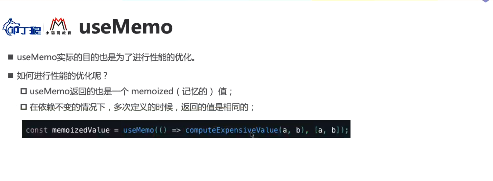

使用方式：

1. useMemo 需要传递两个参数：
   1. 参数一：回调函数，执行回调后，回调的返回值会作为 `useMemo()` 函数的返回值。
   2. 参数二：依赖值，只有依赖值发生变化，才会执行回调函数。
2. useMemo 有一个返回值：
   - 返回的值就是回调函数的返回值。

相当于给回调函数外面包裹了一个壳子。这导致了回调函数不会在每次渲染组件的时候都被执行，而是有条件的在 count 发生更新时，才会执行。提升了性能。


#### **使用场景一：复杂计算**

**只有当创建行为本身会产生高昂的开销（比如计算上千次才会生成变量值），才有必要使用`useMemo`，当然这种场景少之又少。**

```jsx
import React, { useState } from "react";

export default function MemoHookDemo01() {
  const [count, setCount] = useState(10);
  const [show, setShow] = useState(true);

  function calcNumber(count) {
    console.log("执行了clcNumber");
    let total = 0;
    for (let i = 1; i <= count; i++) {
      total += i;
    }
    return total;
  }

  return (
    <div>
      <h2>计算数字的和：{calcNumber(count)}</h2>
      <button onClick={(e) => setCount(count + 1)}> +1 </button>
      <button onClick={(e) => setShow(!show)}>show切换</button>
    </div>
  );
}
```

 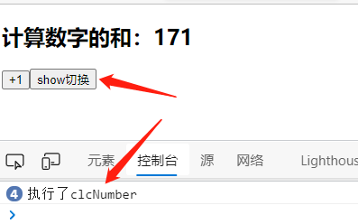

当我们点击 “show切换” 的时候，可以看到 `calcNumber` 也重新执行了。

但是，当点击 “show切换” 时，只改变 `state` 中 `show` 的值，而没有改变 `count` 的值。所以在理想状态下，如果 count 的值不发生改变，最好可以不执行 `calcNumber ` 方法，不需要重新计算 `total` 的值。

这时候就需要使用 `useMemo()` 方法了。

```jsx
import React, { useMemo, useState } from "react";

// 使用 useMemo 解决性能问题。
export default function MemoHookDemo012() {
  const [count, setCount] = useState(10);
  const [show, setShow] = useState(true);

  function calcNumber(count) {
    console.log("执行了clcNumber");
    let total = 0;
    for (let i = 1; i <= count; i++) {
      total += i;
    }
    return total;
  }

  // 使用 UseMemo
  const total = useMemo(() => {
    return calcNumber(count);
  }, [count]);

  return (
    <div>
      <h2>计算数字的和：{total}</h2>
      <button onClick={(e) => setCount(count + 1)}> +1 </button>
      <button onClick={(e) => setShow(!show)}>show切换</button>
    </div>
  );
}
```

 

这时点击 “show切换” 后，就不会执行 `calcNumber` 了，控制台没有输出。


#### 使用场景二：父组件给子组件通过 props 传递局部变量

```jsx
import React, { useState, memo } from "react";

const HYInfo = memo((props) => {
  console.log("HYInfo重新渲染");
  return (
    <div>
      <h2>姓名：{props.info.name}</h2>
      <h2>年龄：{props.info.age}</h2>
    </div>
  );
});

export default function MemoHookDemo021() {
  console.log("MemoHookDemo02渲染");
  const info = { name: "Moxy", age: 18 };
  const [show, setShow] = useState(true);

  return (
    <div>
      <HYInfo info={info} />
      <button onClick={(e) => setShow(!show)}>show切换</button>
    </div>
  );
}
```

即使子组件有 `memo()` 嵌套，当点击 `button` 后，父组件重新渲染，子组件也会重新渲染。

- 可以通过把 `info` 局部变量转化为 useS`t`ate 保存，解决这个问题。

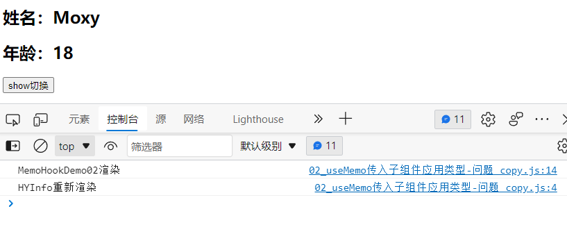

父组件 `MemoHookDemo021` 有：

1. 变量：
   1. state 中有 `show` 变量
   2. 有一个局部变量 `info`，保存了一个对象，对象成员是 `name` 和 `age`。
2. 操作：
   1. 局部变量 `info` 通过 `props` 传递给子组件。
   2. 点击 `button` 后，会改变 show 的值。但不影响 `info` 的值。

子组件 `HYInfo` 有：

1. 子组件通过 `memo()` 包裹。
2. 通过 `props` 接收到父组件传递过来的 `name` 和 `age`，然后显示在页面上。


虽然子组件通过 `memo()` 包裹，当父组件中传递过来的 `props` 和自身 `state` 不发生改变，父组件的重新渲染就不会导致子组件也跟着重新渲染。

但是本例中父组件传递过来的 `info` 是父组件的局部变量，也就是说当父组件点击 `button` 后，发生了父组件的重新渲染，然后局部变量 `info` 就会被重新定义。此时传递给子组件的 `info` 已经不再是上一次传递的 `info` 了，通过 `memo()` 的浅对比发现 `props` 不一致，所以子组件会触发重新渲染。


**使用 useMemo**

```jsx
import React, { useState, memo } from "react";

const HYInfo = memo((props) => {
  console.log("HYInfo重新渲染");
  return (
    <div>
      <h2>姓名：{props.info.name}</h2>
      <h2>年龄：{props.info.age}</h2>
    </div>
  );
});

export default function MemoHookDemo021() {
  console.log("MemoHookDemo02渲染");
  const info = { name: "Moxy", age: 18 };
  const [show, setShow] = useState(true);

  return (
    <div>
      <HYInfo info={info} />
      <button onClick={(e) => setShow(!show)}>show切换</button>
    </div>
  );
}
```

 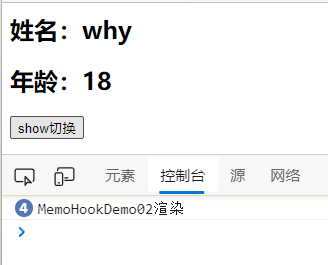

只需要在 `info` 局部变量获取值时，外层套一个 `useMemo()` 即可。因为这里不需要依赖任何值变化，所以第二个参数传入一个空数组。

不论点击 “show切换” 多少次，都不会导致子组件的重新渲染了。


### 3.5 useRef

使用 ref 的另一种方法。

 

1. 为什么不能引用函数式组件？

- 答：因为只有 class组件 才有实例，函数组件没有实例，无法获取。


2. **useRef 保存的值 / 元素一直不变，不论组件如何渲染变化，只要是在同一个生命周期，就保持不变 。** 
   - 除非是自己对值重新定义：


**一个使用场景：**

引用一个值：显示一个 state 保存的值的上一次值。

```jsx
import React, { useRef, useState, useEffect } from "react";

export default function RefHookDemo02() {
  const [count, setCount] = useState(0);
  const numRef = useRef(count);

  useEffect(() => {
    numRef.current = count;
  }, [count]);

  return (
    <div>
      <h2>count 上一次的值:{numRef.current}</h2>
      <h2>count 这一次的值:{count}</h2>
      <button onClick={(e) => setCount(count + 10)}>+10</button>
    </div>
  );
}

```

 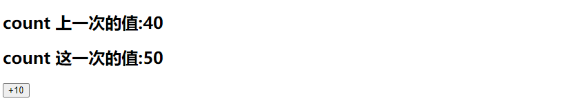

原理：

在组件初始化时，通过 useRef 创建了一个 numRef 保存了初始化时 count 的值，也就是 10。

此时 numRef 保存的不是 count，而是数字 10。

当我们单机 +10 按钮后，调用 setCount 方法，count 总数 +10，但 numRef 的数值不变依然是 0。

组件重新渲染，在页面渲染完毕后，在页面显示到网页前：

1. 要显示的内容已经渲染完毕：显示上一次的值：0，这一次的值 10
2. 会触发 `useEffect()` 中的代码，此时会把 count 的值赋值给 numRef.current ；numRef.current 此时值为 10，但组件已经渲染完毕（componentDidUpdat），所以值虽然修改了，但并未显示到页面上。


### 3.6 useImperativeHandle

#### 回顾 forwardRef 的用法

在父组件，想通过一个方法拿到子组件中的元素。

```jsx
import React, { useRef, forwardRef } from "react";

const HYInput = forwardRef((props, ref) => {
  return <input ref={ref} type="text" />;
});

export default function ForwardRefDemo() {
  const inputRef = useRef();
  return (
    <div>
      <HYInput ref={inputRef} />
      <button onClick={(e) => inputRef.current.focus()}>聚焦</button>
    </div>
  );
}
```

 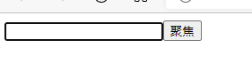

父组件的 `inputRef` 保存了子组件中 `input` 元素。然后点击父组件的聚焦 `button` 后，子组件的输入框被聚焦。

1. 父组件是使用 `useRef()` 创建一个 `ref` 变量。然后通过 `props` 传递给子组件 `ref={inputRef}`；
2. 子组件 `HYInput` 通过一个`forwardRef` 包裹。就可以把父组件的 `ref` 变量传递过来赋值元素。
3. `forwardRef` 拥有两个参数 `(props, ref)`，然后直接把 ref 添加到元素的标签名即可。


#### useImperativeHandle 的用法

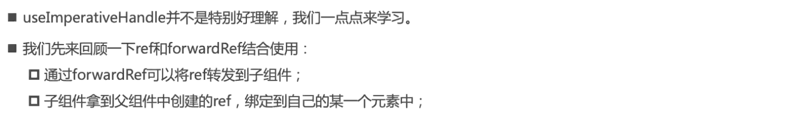

forwardRef 虽然可以实现父组件抓取子组件的元素。 

有缺点：子组件把自己的元素暴露太多了，父组件获取到子组件某个元素的 ref 后，可以对子组件的这个 DOM 元素任意修改。

useImperativeHandle 可以限制这个元素暴露哪些要素，禁止暴露哪些要素

```jsx
import React, { useRef, forwardRef, useImperativeHandle } from "react";

const HYInput = forwardRef((props, ref) => {
  // 子组件定义一个inputRef
  const inputRef = useRef();
  // 使用 ImperativeHandle Hook
  useImperativeHandle(ref, () => ({
    focus: () => {
      console.log("useImperativeHandle中回调函数返回的对象的focus");
      inputRef.current.focus();
    },
  }));

  return <input ref={inputRef} type="text" />;
});

export default function UseImperativeHandleDemo() {
  const inputRef = useRef();

  return (
    <div>
      <HYInput ref={inputRef} />
      <button onClick={(e) => inputRef.current.focus()}>聚焦</button>
    </div>
  );
}
```

1. 在子组件中，自己定义一个 `inputRef` ，
2.  `useImperativeHandle` 回调，传入父组件传递过来的 `ref` 参数，


执行流程：

1. 点击 button 后，调用 `inputRef.current.focus()`，实际上调用的是子组件 `useImperativeHandle` 中的 `focus` 指向的函数。
2. 在子组件 `useImperativeHandle` 中的 `focus`  指向的函数中，有 `inputRef.current.focus();` 中 `inputRef` 实际上是子组件创建的 ref。
3. 所以，最终父组件没有获得子组件的这个元素，而是间接调用了子组件这个元素的 `focus()` 方法。


补充：`useImperativeHandle` 的第二个参数的作用是，当第二个参数传递的值发生更新，`useImperativeHandle` 中的回调函数才会发生更新，也就是重新被定义一次。否则是一直不变的，只会执行。


### 3.7 useLayoutEffect

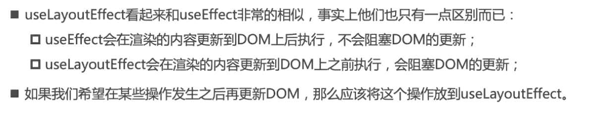

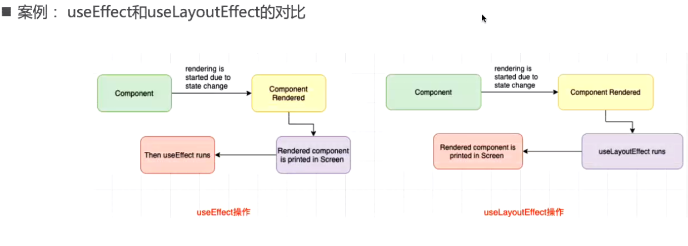

useEffect 的执行流程：

1. Component 的数据发生改变，组件重新 rendered。
2. 重新调用组件代码，然后获取到 return 的 jsx 结构。
3. 通过 diff 算法，生成虚拟 DOM。
4. 然后把  虚拟 DOM 同步到 真实 DOM 上。（页面变化）
5. 最后执行 useEfffect。


useLayoutEffect 的执行流程：

1. Component 的数据发生改变，组件重新 rendered。
2. 重新调用组件代码，然后获取到 return 的 jsx 结构。
3. 通过 diff 算法，生成虚拟 DOM。
4. 执行 useLayoutEffect，此时会 **阻塞 DOM**。
   - **有可能重新渲染**：这里可以 DOM 进行改动，如果进行了改动，会再执行一遍 Component 中的 render，返回一个新的 Jsx，然后 diff 算法 生成虚拟 DOM。
5. 最后改动的虚拟 DOM 同步到 真实 DOM 上。（页面变化）


```jsx
import React, { useState, useEffect } from "react";

export default function EffectCounterDemo() {
  const [count, setCount] = useState(10);

  useEffect(() => {
    if (count === 0) {
      setCount(Math.random());
    }
  }, [count]);

  return (
    <div>
      <h2>数字：{count}</h2>
      <button onClick={(e) => setCount(0)}>修改数字</button>
    </div>
  );
}
```


执行流程：

1. 点击按钮 “修改数字” 后，就会触发 `setCount`，把 `count` 置为 0；
2. 因为 `count` 发生变化，组件重新渲染。
3. 渲染后，需要判断 `useEffect` 是否应当被执行：当  `count` 发生变化时，`useEffect` 要被执行，所以此时执行 `useEffect()`。
4. **页面显示数字：0**。
5. 因为 `count` 的值为 0，所以会执行 `setCount(Math.random()`，赋值一个随机数给 `count`，假设是 0.25132...。
6. 此时 `count` 发生了变化，这导致刚刚渲染好的组件要 **重新再渲染**。
7. 渲染后 `count` 值为 0.25132...，此时继续判断 `useEffect` 是否应当被执行：当  `count` 发生变化时，`useEffect` 要被执行，所以此时执行 `useEffect()`。
8. 因为 `count` 的值不为 0 ，不执行 `useEffect` 中的代码，最终结果界面显示 0.25132...

**点击 “修改数字” 后，画面会有闪动。**

实际上页面会先显示 0，再显示 0.25132...。


解决方案：只需要把 `useEffect` 转换为 `useLayoutEffect` 即可。

- 因为 `useLayoutEffect` 在执行之前，不会渲染页面并展示页面。而是等待 `useLayoutEffect`  再渲染页面。


### 3.8 对比：memo、useCallback 和 useMemo

首先，memo 和 useCallback 、useMemo 是不同的。

- useCallback 、useMemo 是 Hook，在组件内部使用，以提升加载性能。
- 而 memo 在组件的外部使用，通常把一个函数子组件包裹在 `memo()` 中。
  - memo 仅用在函数子组件，而对象子组件是用 PureComponent。
  - memo 的作用原理是，当父组件重新渲染后，memo 会浅对比父组件渲染前后，子组件的 state 和 props 是否发生变化（对象就是对比地址值是否相同，数值就仅对比数值）。


其次，对比 useCallback 和 useMemo：

不同的是：

- useCallback 缓存了父组件传递给子组件的一个【**回调方法**】。缓存的是一个 **函数**。

- useMemo 缓存了一个【变量】，缓存的是一个 **值**。可以用于组件内部缓存值，也可以用于子组件缓存父组件传递的值。

- 换句话说，useCallback 的返回值是一个函数，useMemo 返回的是任意值（数字、对象、函数）。useMemo 可以实现一个 useCallback。

  ```jsx
  // 下面两者的效果是相同的
  const increment1 = useCallback(() => {
      console.log("执行incrememt1函数")
      setCount(count + 1)
  }, [count])
  
  const increment2 = useMemo(() =>{
      return () => {
          console.log("执行increment2函数")
          setCount(count + 1)
      }
  },[count])
  ```

相同的是：

-  `useCallback` 和 `useMemo` 的触发时机相同，如果传递的第二个参数中，有变量发生变化，就会执行回调函数。


### 3.9 对比：Component 和 PureComponent 

父组件渲染，子组件也一定会渲染。

如果我们希望子组件的 state 和 porps 没有变化的时候，不要随着父组件去渲染，就可以使用 PureComponent。


`PureComponent` 组件创建了默认的 `shouldComponentUpdate` 行为。

这个默认的 `shouldComponentUpdate` 行为会一一比较 `props` 和 `state` 中所有的属性，只有当其中任意一项发生改变时，才会进行重绘。

- `PureComponent` 使用浅比较判断组件是否需要重绘。


## 4.4 自定义 Hook

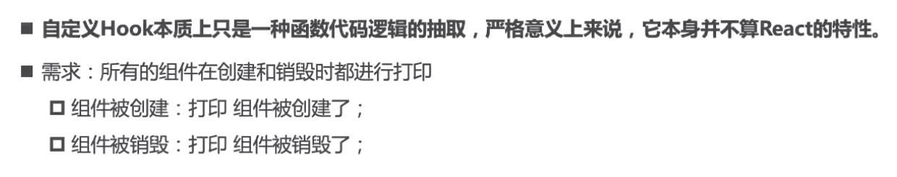

使用 useEffect 就可以实现：

```jsx
useEffect(() => {
    console.log("CustomHookLifeDemo01组件被创建了");
    return () => {
        console.log("CustomHookLifeDemo01组件被销毁了");
    };
}, []);
```

如果想在一个普通函数中使用 hook，要使用自定义 hook：

- 在函数名称前添加 `use` 即可。

```jsx
// 在普通函数中使用，是不允许的
function LoggingLife(name) {
    useEffect(() => {
        console.log("CustomHookLifeDemo01组件被创建了");
        return () => {
            console.log("CustomHookLifeDemo01组件被销毁了");
        };
    }, []);
}

// 在自定义Hook中使用，可以：
function useLoggingLife(name) {
    useEffect(() => {
        console.log("CustomHookLifeDemo01组件被创建了");
        return () => {
            console.log("CustomHookLifeDemo01组件被销毁了");
        };
    }, []);
}
```


